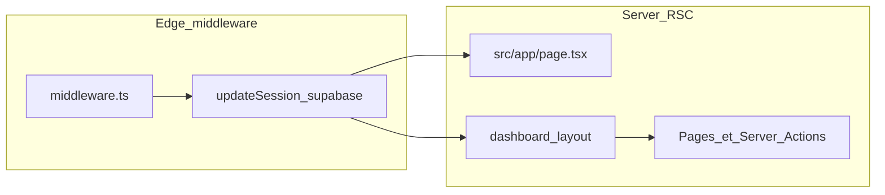

# Contexte audit & stack — Travel Lead Desk (fichier plat)

**Mise à jour : 19 avril 2026**

Ce fichier regroupe le contenu de `docs/audit-claude-pro/` en **un seul document** à la racine de `docs/`, pour les outils (ex. connecteur Git Claude) qui **ne listent pas les sous-dossiers**. Même contenu que le dossier découpé : en cas de modification, mettre à jour **ce fichier et** les fichiers dans `docs/audit-claude-pro/`.

**Ne jamais** coller de secrets (`.env.local`, `service_role`, etc.). La vérité SQL reste dans `supabase/migrations/`.

---

## 1. Introduction (usage Claude)

- Documentation courte pour auditer ou brainstormer **Direction l’Algérie — Travel Lead Desk** avec un LLM.
- Ordre logique ci-dessous : stack → architecture → données → produit → routes → ops → prompts.
- Spec produit complète : `docs/PRODUCT_SPEC.md`.

---

## 2. Stack technique (snapshot)

Aligné sur `package.json` (19 avril 2026).

### Runtime applicatif

| Couche | Technologie | Version |
|--------|-------------|---------|
| Framework | Next.js (App Router) | 16.2.4 |
| UI | React / React DOM | 19.2.4 |
| Langage | TypeScript | ^5 |
| Styles | Tailwind CSS | ^4 |
| Lint | ESLint + eslint-config-next | ^9 / 16.2.4 |

### Backend / données

| Service | Rôle |
|---------|------|
| Supabase | Postgres, Auth, Row Level Security |
| `@supabase/supabase-js` | Client Supabase |
| `@supabase/ssr` | Cookies / SSR avec Next.js |

### Bibliothèques notables

- `@dnd-kit/core`, `@dnd-kit/utilities` — drag & drop (Kanban leads).
- `@react-pdf/renderer` — PDF devis.
- `lucide-react` — icônes.

### Scripts npm

- `npm run dev`, `npm run build` (`next build --webpack`), `npm run start`, `npm run lint`
- `npm run db:link`, `npm run db:push` (Supabase CLI)

### Hébergement

- Vercel, GitHub ; migrations : `supabase/migrations/` ; guide : `docs/DEPLOY_VERCEL.md`.

---

## 3. Architecture applicative

Application **Next.js App Router**, auth **Supabase** (cookies), données via client **anon** + **RLS**.

### Flux requête / session

1. `middleware.ts` → `updateSession` dans `src/lib/supabase/middleware.ts` (client SSR, `getUser()`, cookies).
2. `src/app/page.tsx` : connecté → `/dashboard`, sinon → `/login`.
3. `src/app/(dashboard)/layout.tsx` : `createClient()`, `getUser()`, sinon `redirect("/login")` ; `force-dynamic` / `revalidate = 0`.

### Clients Supabase

- Serveur : `src/lib/supabase/server.ts`
- Client : `src/lib/supabase/client.ts`
- Middleware : `src/lib/supabase/middleware.ts`

Si `NEXT_PUBLIC_SUPABASE_URL` ou `NEXT_PUBLIC_SUPABASE_ANON_KEY` manquent, le middleware ne rafraîchit pas correctement la session.

### Structure `src/`

| Zone | Rôle |
|------|------|
| `src/app/` | Routes, layouts, server actions |
| `src/components/` | UI |
| `src/context/` | Context React (ex. agences démo) |
| `src/lib/` | Mappers, PDF, filtres, CRM |

### Points d’audit

- Sécurité réelle : **RLS** (pas seulement le layout).
- PDF : `src/app/api/leads/[leadId]/quotes/[quoteId]/pdf/route.tsx` — accès et fuites.
- `src/context/agencies-demo-context.tsx` : chemins mock vs Supabase.

---

## 4. Données Supabase (Postgres + RLS)

**Source de vérité** : `supabase/migrations/*.sql`.

### Schéma initial (`20260418120000_initial_core.sql`)

**Enums (extraits)** : `app_role` (`admin`, `lead_referent`), `lead_status` (pipeline ; `refinement` fusionné plus tard), types agence / consultation / `quote_kind`.

**Tables** : `profiles`, `agencies`, `leads`, `consultations`, `quotes`, `activities`, `lead_snapshots`.

**RLS** : migration initiale avec politiques permissives pour `authenticated` ; migrations suivantes resserrent (pool, admin vs référent).

### Migrations ultérieures (ordre)

| Fichier | Intention |
|---------|-----------|
| `20260419140000_leads_intake_columns.sql` | Intake site public (`submission_id`, `intake_payload`, `page_origin`). |
| `20260420100000_leads_rls_select_pool.sql` | SELECT tous les leads pour `authenticated` (pool d’assignation). |
| `20260421120000_co_construction_proposals.sql` | `lead_circuit_proposals` + statuts co-construction. |
| `20260422120000_quotes_workflow_items.sql` | Workflow devis + lignes pour PDF / UI. |
| `20260423140000_rls_admin_vs_referent_v1.sql` | RLS v1 admin / référent + helpers SQL. |
| `20260423150000_profiles_email_display.sql` | `email` sur `profiles`, trigger profil. |
| `20260427120000_qualification_merge_crm.sql` | `refinement` → `qualification` ; champs CRM sur `leads`. |

### Pistes d’audit SQL

- Cohérence policies pool SELECT vs restrictions référent sur `leads`.
- Policies sur `quotes`, `consultations`, `lead_circuit_proposals`.
- Triggers `handle_new_user` (dernière version dans migrations).

---

## 5. Règles produit (résumé)

**Détail** : `docs/PRODUCT_SPEC.md`.

- Outil interne **gestion de leads voyage** (qualification, agences marque blanche, co-construction, devis DA, envoi voyageur).
- **Règle non négociable** : le voyageur ne communique **jamais** directement avec l’agence ; Direction l’Algérie est l’interface unique.
- Rôles : référent lead, admin ; accès agence hors scope initial possible plus tard.

---

## 6. Routes, navigation, mutations

**Nav** (`src/lib/nav-config.tsx`) : `/dashboard`, `/metrics`, `/leads`, `/agencies`, `/quotes`, `/users`, `/settings`.

**Pages** : `/`, `/login`, routes `(dashboard)/…` pour chaque section ; détail `/leads/[id]`.

**API** : `src/app/api/leads/[leadId]/quotes/[quoteId]/pdf/route.tsx`.

**Server actions** : `src/app/(dashboard)/leads/actions.ts`, `quote-actions.ts`, `co-construction-actions.ts`, `src/app/(dashboard)/agencies/actions.ts`.

---

## 7. Opérations et environnement

Variables : `NEXT_PUBLIC_SUPABASE_URL`, `NEXT_PUBLIC_SUPABASE_ANON_KEY` (voir `.env.example`).

Ne pas commiter `.env.local` ni `service_role`.

Déploiement : `docs/DEPLOY_VERCEL.md` (Vercel prod + preview, redirect URLs Supabase, `db:push`). Au moins un profil `admin` après RLS v1 (voir migration `20260423140000`).

---

## 8. Modèles de prompts (à copier-coller)

### 8.1 Audit sécurité (RLS + API)

Tu es un auditeur sécurité sur une app Next.js 16 + Supabase. Contexte : sections 2–4 de ce document + `supabase/migrations/`.

1. Lister les policies RLS par table ; conflits / sur-permissions (pool SELECT vs référent).
2. Vérifier que les server actions ne reposent pas uniquement sur l’UI.
3. Analyser la route PDF devis : contrôle d’accès, fuites, IDs.

Livrable : tableau risques + recommandations + ordre de patch.

### 8.2 Revue performance

Contexte : `force-dynamic` sur layout dashboard, middleware large.

1. Pages/layouts partiellement cacheables sans casser la session.
2. Stratégie simple pour réduire le coût par requête sur Vercel.

### 8.3 Brainstorm fonctionnalités

Règles section 5 + `docs/PRODUCT_SPEC.md`. Périmètre section 6.

Proposer 5–10 améliorations compatibles « voyageur ne parle pas à l’agence », impact / effort, critères d’acceptation.

### 8.4 Checklist pré-production

À partir de section 7 et `docs/DEPLOY_VERCEL.md` : env Vercel, redirect URLs, migrations, admin, login preview, PDF, sauvegardes si applicable.

### 8.5 Revue data model

À partir des migrations : index, contraintes, idempotence `submission_id`, évolution enums CRM / workflow devis. Backlog priorisé.
