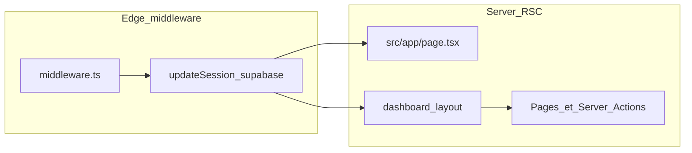

# Contexte audit & stack — Travel Lead Desk (fichier plat)

**Mise à jour : 01 mai 2026** — Qualification Workspace v2 (blocs thématiques structurés).

Ce fichier regroupe le contenu de `docs/audit-claude-pro/` en **un seul document** à la racine de `docs/`, pour les outils (ex. connecteur Git Claude) qui **ne listent pas les sous-dossiers**. Même intention que le dossier découpé : en cas de modification, mettre à jour **ce fichier et** les fichiers dans `docs/audit-claude-pro/`.

**Ne jamais** coller de secrets (`.env.local`, `service_role`, jetons WhatsApp, etc.). La vérité SQL reste dans `supabase/migrations/`.

---

## 0. Index documentation (hors secrets)

| Fichier | Contenu |
|---------|---------|
| `docs/audit-claude-pro/README.md` | Mode d’emploi du bundle + ordre de lecture. |
| `docs/PRD_TRAVEL_LEAD_DESK_V2.md` | Vision produit v2 (IA, WhatsApp, superviseur). |
| `docs/PRODUCT_SPEC.md` | Spec UX / règles détaillées. |
| `docs/IMPLEMENTATION_PENDING_V2.md` | Écarts plan / code (lire avant audit « état réel »). |
| `docs/RLS_PROD_CHECKLIST.md` | Contrôles RLS pré-production. |
| `docs/DEPLOY_VERCEL.md` | Vercel, variables, Supabase Auth URLs, `db:push`. |
| `docs/SQUARESPACE_FORM_INTAKE.md` | Formulaire site → `POST /api/intake`. |
| `docs/PRD_COCKPIT_LEAD_V4.md` | PRD cockpit fiche lead (bande, pipeline, score, encart Dossier). |
| `docs/audit-claude-pro/UI_LAYOUT_AND_VISUAL.md` | **Layout, tokens couleur, typo, panneaux, mobile vs desktop** (aperçu visuel pour maquettes / audits UX). |

**Note** : `IMPLEMENTATION_PENDING_V2.md` peut mélanger tâches **déjà faites** et restantes ; pour l’état DB, se fier aux fichiers dans `supabase/migrations/` plutôt qu’aux blocs SQL dupliqués dans ce doc de suivi.

---

## 0.1 Carte « où est quoi » (chemins repo)

| Sujet | Chemin(s) |
|-------|-----------|
| Middleware session | `middleware.ts`, `src/lib/supabase/middleware.ts` |
| Layout auth dashboard | `src/app/(dashboard)/layout.tsx` (`force-dynamic`) |
| Nav sidebar | `src/lib/nav-config.tsx` (pas de `/settings` dans la liste) |
| Liste + Kanban leads | `src/app/(dashboard)/leads/page.tsx`, `src/components/leads-kanban-board.tsx` (étape = `<select>` sur carte) |
| Détail lead | `src/app/(dashboard)/leads/[id]/page.tsx`, `lead-detail-supabase.tsx`, `LeadCockpitShell` + `lead-cockpit-*.tsx` |
| Workflow opérateur | `src/app/(dashboard)/leads/[id]/workflow/page.tsx` (même cockpit, sans lien fiche) |
| Mapping SQL lead | `src/lib/supabase-lead-detail-map.ts` |
| Score lead (calcul pur) | `src/lib/lead-score.ts` |
| Référence DA-… | `src/lib/lead-reference.ts` ; migration `20260430120000_lead_cockpit_v4.sql` |
| Server actions | `src/app/(dashboard)/leads/actions.ts`, `quote-actions.ts`, `co-construction-actions.ts`, `ai-actions.ts`, `workflow-actions.ts` ; `src/app/(dashboard)/agencies/actions.ts`, `contact-actions.ts`, `logo-actions.ts` |
| Gestion agences | `src/app/(dashboard)/agencies/page.tsx` (liste), `src/app/(dashboard)/agencies/[id]/page.tsx` (détail) ; composants : `src/components/agencies/` ; lib : `src/lib/agencies/` (types, queries, logo-upload) |
| Primitifs agences (UI) | `src/components/agencies/agency-logo.tsx`, `agency-status-badge.tsx`, `agency-card.tsx`, `agency-edit-drawer.tsx`, `agency-delete-dialog.tsx` |
| Pilotage business | `src/app/(dashboard)/dashboard/page.tsx` ; `src/components/ui/sparkline.tsx` |
| IA (prompts, agent) | `src/lib/ai/` (`agent.ts`, `prompts/*.ts` — dont `qualification-suggestions.ts` v2, `types.ts`) |
| Qualification workspace v2 | `src/components/leads/qualification/` (8 composants : `lead-qualification-workspace`, `qualification-block`, `qualification-chips`, `qualification-gate`, `qualification-narrative`, `qualification-progress`, `qualification-status-bar`, `qualification-block-header`, `qualification-blocks-config`) |
| Types blocs qualification | `src/lib/qualification-blocks.ts` (types + helpers `allBlocksValidated`, `safeQualificationBlocks`) |
| API publique / sans UI | `src/app/api/intake/route.ts`, `src/app/api/whatsapp/webhook/route.ts` |
| PDF devis | `src/app/api/leads/[leadId]/quotes/[quoteId]/pdf/route.tsx` |
| Contexte client leads | `src/context/leads-demo-context.tsx` |
| Migrations DB | `supabase/migrations/*.sql` |
| Design system (tokens CSS) | `src/app/globals.css` |
| UI layout détaillé (même contenu que §7.5 en long) | `docs/audit-claude-pro/UI_LAYOUT_AND_VISUAL.md` |

---

## 1. Introduction (usage Claude)

- Documentation pour auditer ou brainstormer **Direction l’Algérie — Travel Lead Desk** avec un LLM.
- Ordre logique ci-dessous : stack → architecture → **UI / design** (§7.5) → données → produit → routes → ops → prompts.
- Vision produit v2 : `docs/PRD_TRAVEL_LEAD_DESK_V2.md` ; spec détaillée : `docs/PRODUCT_SPEC.md` ; écart code / schéma : `docs/IMPLEMENTATION_PENDING_V2.md`.

---

## 2. Stack technique (snapshot)

Aligné sur `package.json` (20 avril 2026).

### Runtime applicatif

| Couche | Technologie | Version |
|--------|-------------|---------|
| Framework | Next.js (App Router) | 16.2.4 |
| UI | React / React DOM | 19.2.4 |
| Langage | TypeScript | ^5 |
| Styles | Tailwind CSS | ^4 |
| Lint | ESLint + eslint-config-next | ^9 / 16.2.4 |

### Backend / données

| Service | Rôle |
|---------|------|
| Supabase | Postgres, Auth, Row Level Security |
| `@supabase/supabase-js` | Client Supabase |
| `@supabase/ssr` | Cookies / SSR avec Next.js |

### Bibliothèques notables

- `openai` — appels modèle côté serveur (qualification, scoring, comparaison ; voir `src/lib/ai/`).
- `resend` — emails transactionnels (désactivé si clés absentes).
- `@react-pdf/renderer` — PDF devis.
- `lucide-react` — icônes.

**Kanban** : pas de `@dnd-kit` dans le manifest ; colonnes + changement d’étape via `<select>` sur chaque carte (`leads-kanban-board.tsx`).

### Scripts npm

- `npm run dev`, `npm run build` (`next build --webpack`), `npm run start`, `npm run lint`
- `npm run db:link`, `npm run db:push` (Supabase CLI)

### Hébergement

- Vercel, GitHub ; migrations : `supabase/migrations/` ; guide : `docs/DEPLOY_VERCEL.md`.

---

## 3. Architecture applicative

Application **Next.js App Router**, auth **Supabase** (cookies), données via client **anon** + **RLS**.

### Flux requête / session

1. `middleware.ts` → `updateSession` dans `src/lib/supabase/middleware.ts` (client SSR, `getUser()`, cookies).
2. `src/app/page.tsx` : connecté → `/dashboard`, sinon → `/login`.
3. `src/app/(dashboard)/layout.tsx` : `createClient()`, `getUser()`, sinon `redirect("/login")` ; `force-dynamic` / `revalidate = 0`.

### Clients Supabase

- Serveur : `src/lib/supabase/server.ts`
- Client : `src/lib/supabase/client.ts`
- Middleware : `src/lib/supabase/middleware.ts`

Si `NEXT_PUBLIC_SUPABASE_URL` ou `NEXT_PUBLIC_SUPABASE_ANON_KEY` manquent, le middleware ne rafraîchit pas correctement la session.

### Intégrations sensibles (hors session navigateur)

- **`POST /api/intake`** : CORS (`ALLOWED_ORIGIN`), secret optionnel, souvent `SUPABASE_SERVICE_ROLE_KEY` pour insérer des leads.
- **Webhook WhatsApp** : challenge GET, POST signé optionnel (`WHATSAPP_APP_SECRET`), tokens dans l’environnement serveur.
- **OpenAI** : uniquement serveur ; jamais de clé en `NEXT_PUBLIC_*`.

### Structure `src/`

| Zone | Rôle |
|------|------|
| `src/app/` | Routes, layouts, server actions |
| `src/components/` | UI |
| `src/context/` | Context React (`LeadsDemoProvider`, etc.) |
| `src/lib/` | Mappers, PDF, filtres, CRM, `ai/` |

### Points d’audit

- Sécurité réelle : **RLS** (pas seulement le layout) ; voir aussi `docs/RLS_PROD_CHECKLIST.md`.
- PDF + Storage : route PDF ; bucket privé `quote_pdfs` (migration) — vérifier policies `storage.objects` en prod si le bucket est utilisé.
- Server actions `ai-actions.ts` / `workflow-actions.ts` : mêmes exigences d’autorisation que le reste (ne pas se fier à l’UI).

---

## 4. Données Supabase (Postgres + RLS)

**Source de vérité** : `supabase/migrations/*.sql`.

### Schéma initial (`20260418120000_initial_core.sql`)

**Enums (extraits)** : `app_role` (`admin`, `lead_referent`), `lead_status` (voir liste ci-dessous), types agence / consultation / `quote_kind`.

**`lead_status` à la création** : `new`, `qualification`, `refinement`, `agency_assignment`, `co_construction`, `quote`, `negotiation`, `won`, `lost`. La migration `20260427120000_qualification_merge_crm.sql` fusionne **`refinement` → `qualification`** (valeur enum et données).

**Tables** : `profiles`, `agencies`, `leads`, `consultations`, `quotes`, `activities`. La table `lead_snapshots` a existé dans le core initial puis est **supprimée** par `20260428100000_travel_lead_desk_v2.sql`.

**RLS** : migration initiale avec politiques permissives pour `authenticated` ; migrations suivantes resserrent (pool, admin vs référent).

### Migrations ultérieures (ordre des fichiers)

| Fichier | Intention |
|---------|-----------|
| `20260419140000_leads_intake_columns.sql` | Intake site public (`submission_id`, `intake_payload`, `page_origin`). |
| `20260420100000_leads_rls_select_pool.sql` | SELECT tous les leads pour `authenticated` (pool d’assignation). |
| `20260421120000_co_construction_proposals.sql` | `lead_circuit_proposals` + statuts co-construction. |
| `20260422120000_quotes_workflow_items.sql` | Workflow devis + lignes pour PDF / UI. |
| `20260423140000_rls_admin_vs_referent_v1.sql` | RLS v1 admin / référent + helpers SQL. |
| `20260423150000_profiles_email_display.sql` | `email` sur `profiles`, trigger profil. |
| `20260427120000_qualification_merge_crm.sql` | `refinement` → `qualification` ; champs CRM sur `leads`. |
| `20260428100000_travel_lead_desk_v2.sql` | Colonnes v2 : canaux intake / WhatsApp, transcript, payload IA qualification, validation superviseur, enrichissement propositions & agences & quotes, index ; **drop** `lead_snapshots`. |
| `20260428120000_quote_pdfs_bucket.sql` | Bucket Storage `quote_pdfs` (privé, PDF, limite taille). |
| `20260429100000_lead_workflow_v3_iter1.sql` | `workflow_launched_at`, `workflow_launched_by`, `workflow_mode` (`ai` \| `manual`). |

### Pistes d’audit SQL

- Cohérence policies pool SELECT vs restrictions référent sur `leads`.
- Policies sur `quotes`, `consultations`, `lead_circuit_proposals`.
- Triggers `handle_new_user` (dernière version dans migrations).
- Storage : le fichier bucket seul ne définit pas les policies — vérifier en prod.

---

## 5. Règles produit (résumé)

**Détail** : `docs/PRODUCT_SPEC.md`.

- Outil interne **gestion de leads voyage** (qualification, agences marque blanche, co-construction, devis DA, envoi voyageur).
- **Règle non négociable** : le voyageur ne communique **jamais** directement avec l’agence ; Direction l’Algérie est l’interface unique.
- Rôles : référent lead, admin ; accès agence hors scope initial possible plus tard.

---

## 6. Routes, navigation, mutations

**Nav** (`src/lib/nav-config.tsx`) : `/dashboard`, `/metrics`, `/leads`, `/agencies`, `/quotes`, `/users`. **`/settings` absent de la sidebar** ; la route `/settings` existe encore.

**Pages** : `/`, `/login`, `(dashboard)/…` ; détail `/leads/[id]` ; workflow `/leads/[id]/workflow`.

**API** : `src/app/api/intake/route.ts`, `src/app/api/whatsapp/webhook/route.ts`, `src/app/api/leads/[leadId]/quotes/[quoteId]/pdf/route.tsx`.

**Server actions** : `leads/actions.ts`, `quote-actions.ts`, `co-construction-actions.ts`, `ai-actions.ts`, `workflow-actions.ts`, `agencies/actions.ts`.

---

## 7. Opérations et environnement

Variables documentées : voir **`.env.example`** (liste complète : Supabase, Resend, OpenAI, WhatsApp, intake CORS/secret).

Ne pas commiter `.env.local` ni `service_role`.

Déploiement : `docs/DEPLOY_VERCEL.md`. Au moins un profil `admin` après RLS v1 (voir migration `20260423140000`).

---

## 7.5 UI, layout et rendu visuel (aperçu pour maquettes mentales)

**Source détaillée** (identique, plus schéma mermaid + checklist fichiers) : `docs/audit-claude-pro/UI_LAYOUT_AND_VISUAL.md`.

### Direction artistique

- **SaaS clair** : fond `#fafafa`, cartes blanches, bordures `#e6ebef`, texte secondaire gris-bleu.
- **Accent marque** : `#182b35` (*steel*) — nav active, titres d’étape, focus anneau `ring-steel/25`.
- **Bandeaux sombres** : gradient `#0f1c24` → `#182b35` pour le **bloc logo** (sidebar + drawer) et le **header mobile** ; texte blanc / blanc 72–78 % opacité pour sous-titres.
- **Typo** : **Poppins** (corps, UI) ; **Cormorant Garamond** (`font-display`) pour titres éditoriaux sur la fiche lead.

### Tokens (`src/app/globals.css`)

| Token | Hex / rôle |
|-------|----------------|
| `--background` | `#fafafa` |
| `--foreground` | `#0b0c0d` |
| `--panel` | `#ffffff` (surfaces principales) |
| `--panel-muted` | `#f4f7fa` (inputs, thead, fonds secondaires) |
| `--border` | `#e6ebef` |
| `--steel` | `#182b35` |
| `--steel-ink` | `#f3f7fa` (texte sur fond steel) |
| `--muted-foreground` | `#60727c` |

### Coque `lg+` (`src/app/(dashboard)/layout.tsx`)

- Grille `lg:grid-cols-[18rem_minmax(0,1fr)]` (18rem ≈ `w-72` du sidebar).
- **Sidebar** (`SidebarNav`) : sticky, scroll vertical, `bg-panel`, liens `rounded-none` ; actif = fond + bordure `#182b35`, texte/icône `#f3f7fa` ; inactif = `bg-panel-muted` + hover bordure.
- **Colonne droite** : header **blanc** `border-neutral-200`, email + déconnexion ; `main` paddings responsive `px-4` → `lg:px-8`.
- **Mobile** : `DashboardMobileNav` — barre gradient + menu tiroir ; sidebar desktop `hidden` sous `lg`.

### Panneaux métier (vocabulaire Tailwind récurrent)

- Bloc standard : `rounded-md border border-border bg-panel` + padding `p-4 sm:p-6`.
- Sous-zones atténuées : `bg-panel-muted/30` … `/80`, parfois `border-dashed` pour vide.
- Fiche lead « étape active » : bordure `border-[#182b35]/25` sur la section workspace (`lead-supabase-stage-workspace.tsx`).
- **Pipeline bas d’écran** (navigation étapes) : barre arrondie, `backdrop-blur`, `bg-panel/45`, ombre légère vers le haut.
- **Leads** : toggle liste/Kanban dans `rounded-md border bg-panel-muted p-0.5` ; table dans `section` bordée `bg-panel` ; Kanban colonnes étroites, cartes `shadow-sm`, **`<select>`** d’étape sur chaque carte.
- **Login** : page centrée sur `bg-neutral-100` (distinct du token page app).

### Fichiers utiles dessin / audit visuel

`src/app/layout.tsx`, `src/app/globals.css`, `src/app/(dashboard)/layout.tsx`, `src/components/sidebar-nav.tsx`, `src/components/dashboard-mobile-nav.tsx`, `src/components/brand-logo-block.tsx`, `src/lib/brand-assets.ts`, `src/app/(dashboard)/leads/leads-page-inner.tsx`, `src/components/leads-kanban-board.tsx`, `src/components/leads/lead-cockpit-shell.tsx`, `src/components/leads/lead-supabase-stage-workspace.tsx`.

---

## 8. Modèles de prompts (à copier-coller)

### 8.1 Audit sécurité (RLS + API)

Tu es un auditeur sécurité sur une app Next.js 16 + Supabase. Contexte : sections 2–4 de ce document + `supabase/migrations/`.

1. Lister les policies RLS par table ; conflits / sur-permissions (pool SELECT vs référent).
2. Vérifier que les server actions (y compris `ai-actions.ts`, `workflow-actions.ts`) ne reposent pas uniquement sur l’UI.
3. Analyser la route PDF devis : contrôle d’accès, fuites, IDs.
4. Analyser `api/intake` et `api/whatsapp/webhook` : CORS, secrets, idempotence, réponses.

Livrable : tableau risques + recommandations + ordre de patch.

### 8.2 Revue performance

Contexte : `force-dynamic` sur layout dashboard, middleware large.

1. Pages/layouts partiellement cacheables sans casser la session.
2. Stratégie simple pour réduire le coût par requête sur Vercel.

Livrable : hypothèses + changements ciblés.

### 8.3 Brainstorm fonctionnalités

Règles section 5 + `docs/PRODUCT_SPEC.md`. Périmètre section 6.

Proposer 5–10 améliorations compatibles « voyageur ne parle pas à l’agence », impact / effort, critères d’acceptation.

### 8.4 Checklist pré-production

À partir de section 7, `docs/DEPLOY_VERCEL.md` et `docs/RLS_PROD_CHECKLIST.md` : env Vercel, redirect URLs, migrations, admin, login preview, PDF, intake, WhatsApp, sauvegardes si applicable.

### 8.5 Revue data model

À partir des migrations : index, contraintes, idempotence `submission_id`, évolution enums CRM / workflow devis, colonnes v2/v3 sur `leads`, bucket `quote_pdfs`. Backlog priorisé.

### 8.6 Audit flux IA (superviseur)

Contexte : `src/lib/ai/`, champs `ai_*` et `qualification_validation_*` sur `leads` / propositions, `docs/PRD_TRAVEL_LEAD_DESK_V2.md`.

1. Où l’opérateur peut-il valider / overrider sans casser la traçabilité ?
2. Risques d’injection ou de fuite PII dans les prompts ; journalisation minimale recommandée.

Livrable : liste de garde-fous + tests manuels suggérés.

### 8.7 Cohérence UI & accessibilité (optionnel)

Contexte : section **7.5** + `docs/audit-claude-pro/UI_LAYOUT_AND_VISUAL.md` + `src/app/globals.css`.

1. Contrastes (muted, blanc /72 sur gradient).
2. Cohérence header blanc (desktop) vs barre sombre (mobile).
3. Focus / `aria` sur zones interactives (Kanban, pipeline bas).

Livrable : liste courte priorisée.
