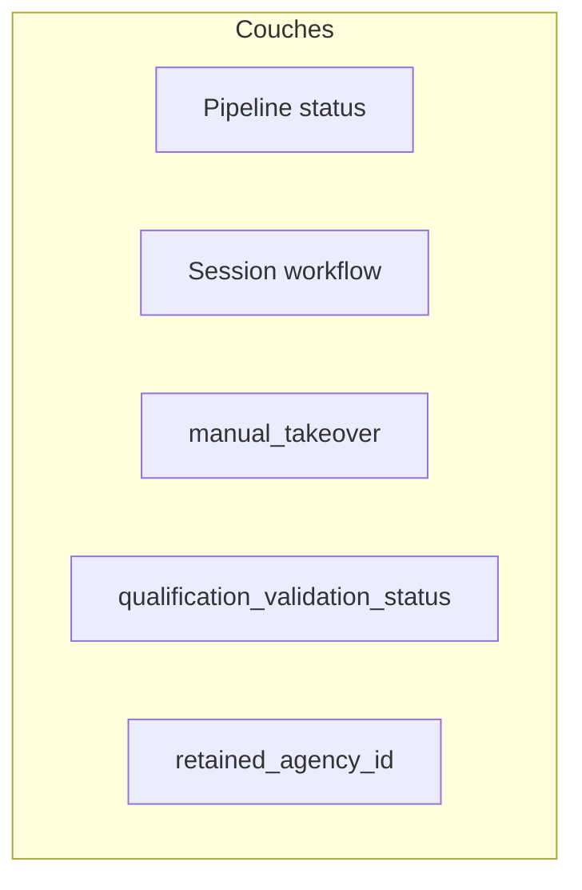
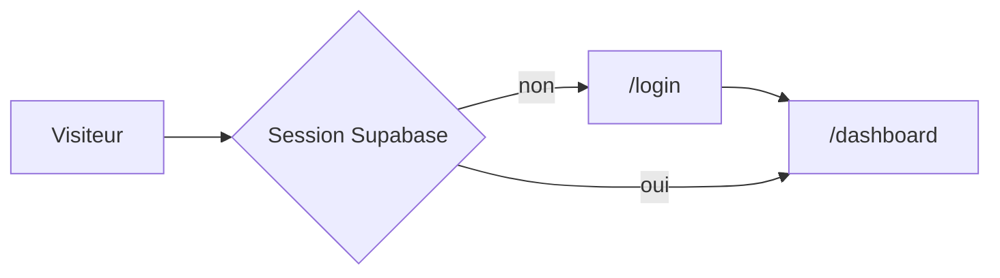
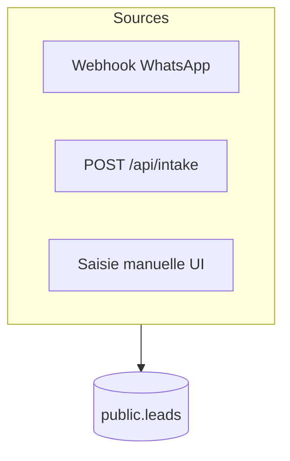
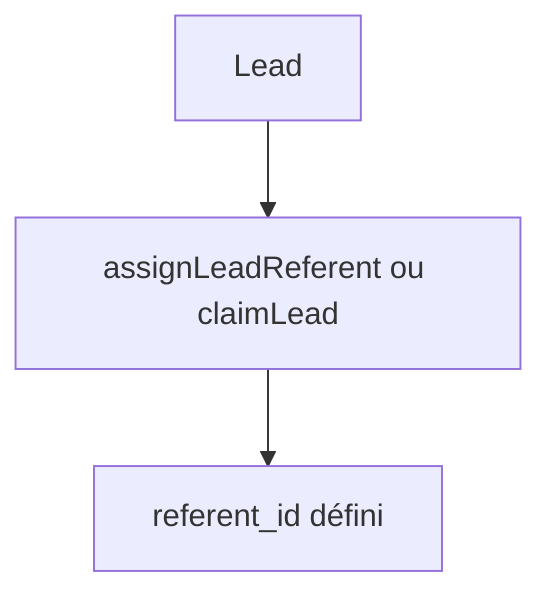
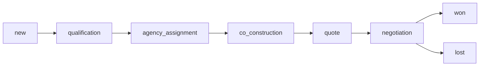
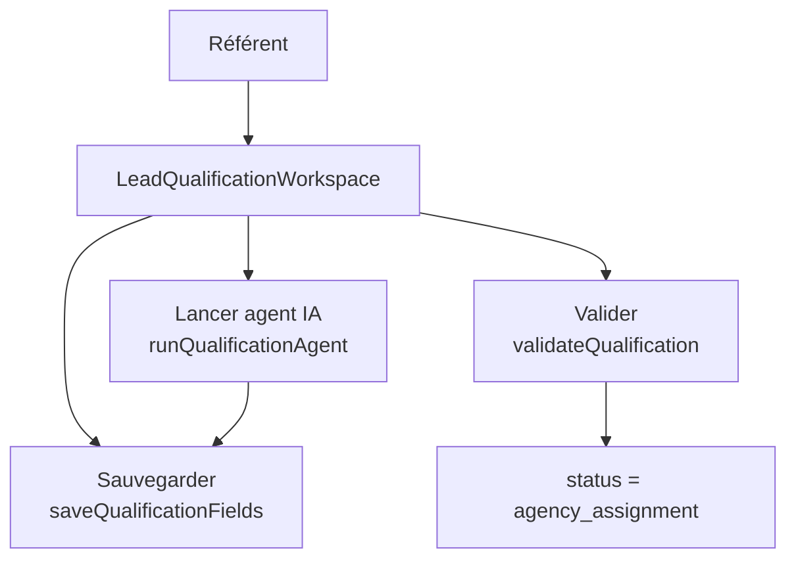

# Parcours utilisateur, pipeline et garde-fous (doc vivante)

| Champ | Valeur |
|-------|--------|
| **Périmètre** | Cockpit lead (`/leads/[id]`), liste leads, workflow voyageur (`/leads/[id]/workflow`), statuts pipeline Supabase, gates brief, intake, webhooks ; effets **côté opérateur** des politiques RLS. |
| **Dernière revue** | 2026-04-20 — P0 appliqué : transitions pipeline adjacentes (hors admin), nettoyage session workflow à la sortie de `qualification` et à la réassignation du référent ; UI cockpit / select filtré. Archive : [`CODE_PATCHES_P0_FROM_PLAN.md`](./CODE_PATCHES_P0_FROM_PLAN.md). |
| **Sources de vérité** | Runtime : code dans `src/app/(dashboard)/leads/actions.ts`, `workflow-actions.ts`, `lead-brief-gate.ts`. Spec produit : [`PRODUCT_SPEC.md`](./PRODUCT_SPEC.md). |

## Carte des zones code (à re-vérifier quand le flux change)

- `src/app/(dashboard)/leads/actions.ts` — pipeline, référent, gates
- `src/app/(dashboard)/leads/workflow-actions.ts` — session workflow, reset
- `src/app/(dashboard)/leads/ai-actions.ts` — IA, `manual_takeover`
- `src/lib/lead-brief-gate.ts` — brief exploitable, qualification sign-off
- `src/components/leads/lead-cockpit-shell.tsx`, `lead-cockpit-pipeline.tsx`, `lead-cockpit-bottom-nav.tsx`
- `src/app/api/intake/`, `src/app/api/whatsapp/webhook/`
- `supabase/migrations/`, [`RLS_PROD_CHECKLIST.md`](./RLS_PROD_CHECKLIST.md)

---

## Modèle d’état multi-couches

Un dossier combine plusieurs dimensions qui évoluent **indépendamment** dans la base :

1. **Statut pipeline** — `leads.status` (`new` → … → `won` / `lost`).
2. **Session workflow voyageur** — `workflow_launched_at`, `workflow_mode`, `workflow_run_ref`, `workflow_launched_by`.
3. **Reprise manuelle IA** — `manual_takeover`.
4. **Validation qualification** — `qualification_validation_status`.
5. **Agence retenue** — `retained_agency_id` (après assignation).

---

## Parcours : authentification

---

## Parcours : entrée d’un lead

---

## Parcours : référent (opérateur travel desk)

- **Allouer** : `assignLeadReferent` ; **prendre** : `claimLead`.
- Tant que `referent_id` est vide, le passage hors `new` est bloqué (`assertLeadStatusTransition`).

---

## Parcours : pipeline linéaire (intention produit)

Ordre : `LEAD_PIPELINE` dans `src/lib/mock-leads.ts`.

### Vérité serveur : `updateLeadStatus` vs `moveLeadPipelineStep`

- **`moveLeadPipelineStep`** : avance ou recule **d’une seule** étape — aligné avec le parcours linéaire.
- **`updateLeadStatus`** : accepte un statut cible **quelconque** tant que les garde-fous passent — d’où l’écart historique avec les schémas (voir conflit **C1** et correctif dans [`CODE_PATCHES_P0_FROM_PLAN.md`](./CODE_PATCHES_P0_FROM_PLAN.md)).

---

## Parcours : qualification — IA / manuel / hybride

- Lancement workflow : `launchWorkflowAi` / `launchWorkflowManual` (`workflow-actions.ts`) ; seul le **référent** du dossier.
- **Reset session** : `resetWorkflowVoyageurSession` (remet entre autres `manual_takeover` à `false` et nettoie transcript / brouillon qualification — voir code).

### Workspace qualification (`LeadQualificationWorkspace`)

Composant affiché à l'étape `qualification` dans `lead-supabase-stage-workspace.tsx`.
Remplace l'ancienne grille CRM express (`LeadCommercialCrmForm`) pour cette étape.

**Actions disponibles :**

| Action | Server action | Effet |
|--------|--------------|-------|
| Lancer l'agent IA | `runQualificationAgent` (`ai-actions.ts`) | Appelle Claude Haiku (Anthropic), pré-remplit les champs + narrative, sauvegarde en base |
| Sauvegarder | `saveQualificationFields` (`ai-actions.ts`) | Persiste les champs éditables sans changer le statut |
| Valider | `validateQualification` (`ai-actions.ts`) | `qualification_validation_status = 'validated'` + `status = 'agency_assignment'` |

**Champs gérés :** `destination_main`, `trip_dates`, `travelers`, `budget`, `travel_style`, `travel_desire_narrative`, `qualification_notes`.

**Prérequis validation :** destination + dates + groupe + budget + narrative (≥ 20 car.) tous remplis.

**Variable d'env requise :** `ANTHROPIC_API_KEY` (server-only). Si absente, bouton IA désactivé avec message d'erreur gracieux.

---

## Parcours : gate « brief prêt » → assignation agence

- Implémentation : `isLeadBriefExploitable` / `getBriefGateBlockMessage` (`lead-brief-gate.ts`) + `assertBriefExploitableBeforeAgencyAssignment` (`actions.ts`) sur `qualification` → `agency_assignment`.

---

## Parcours : après assignation agence

- `retained_agency_id` requis avant d’aller au-delà de `agency_assignment` (`assertLeadStatusTransition`).
- Sortie de `co_construction` vers `quote` : proposition approuvée liée à un devis ou devis existant (`assertCoConstructionApprovedIfLeaving`).

---

## Conflits connus (C1–C8)

| ID | Sujet | Mitigation / correctif |
|----|--------|-------------------------|
| C1 | Sauts d’étape via `updateLeadStatus` | Adjacent strict hors admin — voir patch doc |
| C2 | Session workflow alors que le statut a quitté `qualification` | Nettoyer champs session à la sortie de `qualification` — voir patch doc |
| C3 | Changement de référent vs session | Clear session à la réassignation — voir patch doc |
| C4 | `manual_takeover` vs tâches async | Matrice à documenter par audit code ; respect takeover sur chaque écriture |
| C5 | Brief gate / mode manuel / hybride | Copie UX + règles dans `lead-brief-gate.ts` |
| C6 | Reset session et `manual_takeover` | Déjà aligné dans `resetWorkflowVoyageurSession` (`manual_takeover: false`) |
| C7 | Doc vs code (`triggerQualificationConversation`) | Voir [`IMPLEMENTATION_PENDING_V2.md`](./IMPLEMENTATION_PENDING_V2.md) |
| C8 | RLS vs Server Actions | [`RLS_PROD_CHECKLIST.md`](./RLS_PROD_CHECKLIST.md) |

---

## Changelog parcours (récent)

| Date | Changement |
|------|------------|
| 2026-04-20 | Création de ce document ; correctifs P0 mergés dans le code (`actions.ts`, cockpit pipeline, `lead-supabase-pipeline`). |
| 2026-04-20 | Refonte UI/UX complète : inbox, cockpit 3 colonnes, dashboard pilotage, liste leads. |
| 2026-04-20 | Workspace qualification unifié : `LeadQualificationWorkspace` + agent Claude Haiku + 3 server actions. Migration `destination_main`, `travel_desire_narrative`, `qualification_notes`. |

---

## Règle d’évolution (obligatoire)

Toute PR qui modifie **pipeline**, **workflow voyageur**, **gates brief**, **référent**, **intake** ou **RLS** sur les leads doit **mettre à jour ce fichier** (diagrammes, tableau C1–C8, ou changelog) dans la **même PR**, sauf urgence avec PR de suivi sous 48 h et todo explicite.

Voir aussi [`CONTRIBUTING.md`](../CONTRIBUTING.md).
