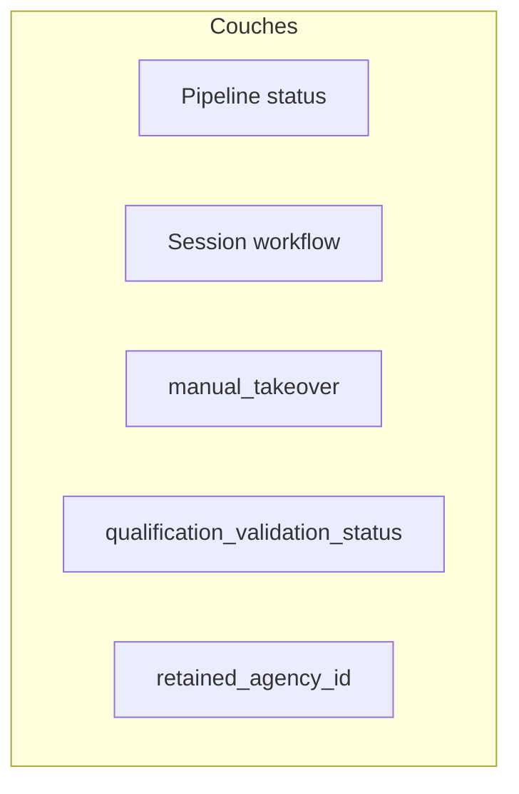
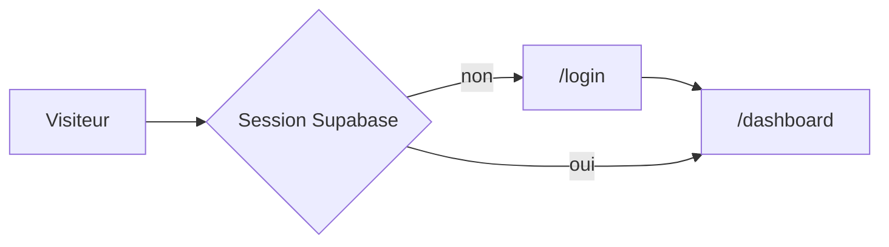
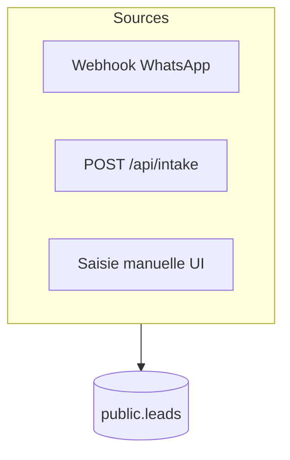
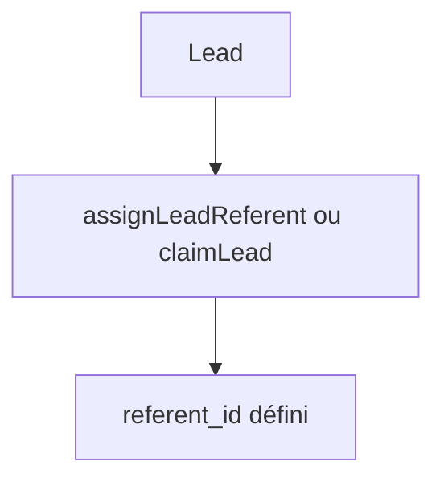
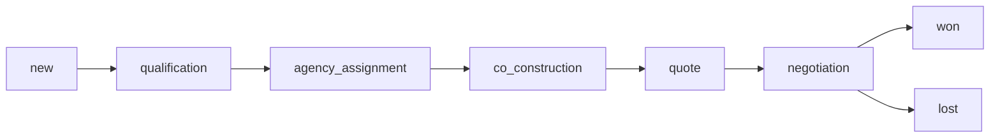
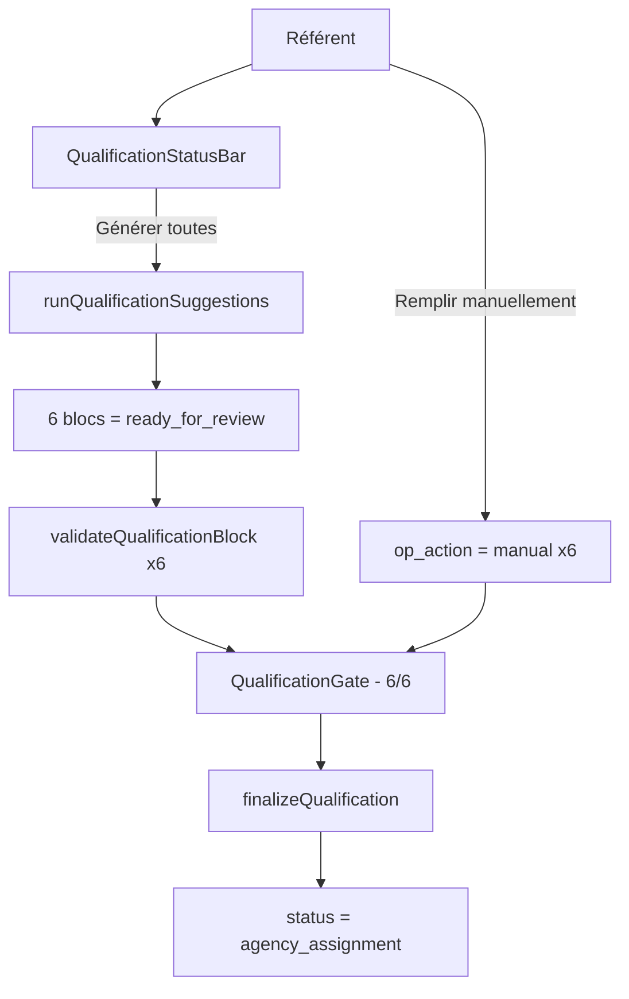

# Parcours utilisateur, pipeline et garde-fous (doc vivante)

| Champ | Valeur |
|-------|--------|
| **Périmètre** | Cockpit lead (`/leads/[id]`), liste leads, workflow voyageur (`/leads/[id]/workflow`), statuts pipeline Supabase, gates brief, intake, webhooks ; effets **côté opérateur** des politiques RLS. |
| **Dernière revue** | 2026-05-01 — Qualification Workspace v2 : 6 blocs thématiques structurés remplacent les champs libres + statut global. Gate brief refactorée sur `allBlocksValidated`. Archive précédent : [`CODE_PATCHES_P0_FROM_PLAN.md`](./CODE_PATCHES_P0_FROM_PLAN.md). |
| **Sources de vérité** | Runtime : code dans `src/app/(dashboard)/leads/actions.ts`, `workflow-actions.ts`, `lead-brief-gate.ts`. Spec produit : [`PRODUCT_SPEC.md`](./PRODUCT_SPEC.md). |

## Carte des zones code (à re-vérifier quand le flux change)

- `src/app/(dashboard)/leads/actions.ts` — pipeline, référent, gates
- `src/app/(dashboard)/leads/workflow-actions.ts` — session workflow, reset
- `src/app/(dashboard)/leads/ai-actions.ts` — IA, `manual_takeover`
- `src/lib/lead-brief-gate.ts` — brief exploitable, qualification sign-off
- `src/components/leads/lead-cockpit-shell.tsx`, `lead-cockpit-pipeline.tsx`, `lead-cockpit-bottom-nav.tsx`
- `src/app/api/intake/`, `src/app/api/whatsapp/webhook/`
- `supabase/migrations/`, [`RLS_PROD_CHECKLIST.md`](./RLS_PROD_CHECKLIST.md)

---

## Modèle d’état multi-couches

Un dossier combine plusieurs dimensions qui évoluent **indépendamment** dans la base :

1. **Statut pipeline** — `leads.status` (`new` → … → `won` / `lost`).
2. **Session workflow voyageur** — `workflow_launched_at`, `workflow_mode`, `workflow_run_ref`, `workflow_launched_by`.
3. **Reprise manuelle IA** — `manual_takeover`.
4. **Validation qualification** — `qualification_validation_status`.
5. **Agence retenue** — `retained_agency_id` (après assignation).

---

## Parcours : authentification

---

## Parcours : entrée d’un lead

---

## Parcours : référent (opérateur travel desk)

- **Allouer** : `assignLeadReferent` ; **prendre** : `claimLead`.
- Tant que `referent_id` est vide, le passage hors `new` est bloqué (`assertLeadStatusTransition`).

---

## Parcours : pipeline linéaire (intention produit)

Ordre : `LEAD_PIPELINE` dans `src/lib/mock-leads.ts`.

### Vérité serveur : `updateLeadStatus` vs `moveLeadPipelineStep`

- **`moveLeadPipelineStep`** : avance ou recule **d’une seule** étape — aligné avec le parcours linéaire.
- **`updateLeadStatus`** : accepte un statut cible **quelconque** tant que les garde-fous passent — d’où l’écart historique avec les schémas (voir conflit **C1** et correctif dans [`CODE_PATCHES_P0_FROM_PLAN.md`](./CODE_PATCHES_P0_FROM_PLAN.md)).

---

## Parcours : qualification v2 — 6 blocs thématiques

> **v2 (2026-05-01)** — Remplace le workspace v1 (champs libres + statut global). Composant : `src/components/leads/qualification/lead-qualification-workspace.tsx`.

### 6 blocs structurés

| Bloc | Description | Sections |
|------|-------------|----------|
| `vibes` | Ambiance & type de voyage | expériences, rythme, structure |
| `group` | Composition du groupe | taille, profil, niveau physique |
| `timing` | Temporalité | durée, saison, flexibilité |
| `stay` | Hébergement | type, confort |
| `highlights` | Incontournables & contraintes | must-see, évitements, contraintes |
| `budget` | Budget | fourchette, valeur, inclusions |

### 4 états d'un bloc

| État (`ai_status` / `op_action`) | Affichage |
|----------------------------------|-----------|
| `pending` + `op_action=null` | En attente (gris) — boutons "Suggestions IA" ou "Remplir manuellement" |
| `in_progress` + `op_action=null` | IA en cours (ambre, spinner) |
| `ready_for_review` + `op_action=null` | Prêt à valider (bleu) — chips IA affichées, actions Confirmer/Ajuster/Manuel |
| tout + `op_action!=null` | Validé (vert) — chips figées, bouton "Modifier" |

### Actions disponibles (v2)

| Action | Server action | Effet |
|--------|--------------|-------|
| Générer suggestions | `runQualificationSuggestions` | OpenAI → suggestions chips par bloc, confiance, sections manquantes |
| Valider un bloc | `validateQualificationBlock` | `op_action = confirmed/adjusted/manual` + `op_validated_at` |
| Mettre à jour sélections | `updateBlockSelections` | Sélections intermédiaires sans validation |
| Rouvrir un bloc | `reopenQualificationBlock` | Reset `op_action=null`, conserve sélections |
| Valider la qualification | `finalizeQualification` | Vérifie 6 blocs validés → `status = agency_assignment` |

**Variable d'env requise :** `OPENAI_API_KEY` (server-only).

### Lancement workflow (inchangé v1)

- `launchWorkflowAi` / `launchWorkflowManual` (`workflow-actions.ts`) ; seul le **référent** du dossier.
- **Reset session** : `resetWorkflowVoyageurSession`.

---

## Parcours : gate « brief prêt » → assignation agence

- **v2** : `isLeadBriefExploitable` retourne `allBlocksValidated(lead.qualification_blocks)`. Tous les 6 blocs doivent avoir `op_action !== null`.
- **Fallback v1** : si `qualification_blocks` est absent (leads legacy), la gate utilise la checklist 8-champs + `qualification_validation_status`.
- Implémentation : `isLeadBriefExploitable` / `getBriefGateBlockMessage` (`lead-brief-gate.ts`) + `assertBriefExploitableBeforeAgencyAssignment` (`actions.ts`) sur `qualification` → `agency_assignment`.

---

## Parcours : après assignation agence

- `retained_agency_id` requis avant d’aller au-delà de `agency_assignment` (`assertLeadStatusTransition`).
- Sortie de `co_construction` vers `quote` : proposition approuvée liée à un devis ou devis existant (`assertCoConstructionApprovedIfLeaving`).

---

## Conflits connus (C1–C8)

| ID | Sujet | Mitigation / correctif |
|----|--------|-------------------------|
| C1 | Sauts d’étape via `updateLeadStatus` | Adjacent strict hors admin — voir patch doc |
| C2 | Session workflow alors que le statut a quitté `qualification` | Nettoyer champs session à la sortie de `qualification` — voir patch doc |
| C3 | Changement de référent vs session | Clear session à la réassignation — voir patch doc |
| C4 | `manual_takeover` vs tâches async | Matrice à documenter par audit code ; respect takeover sur chaque écriture |
| C5 | Brief gate / mode manuel / hybride | Copie UX + règles dans `lead-brief-gate.ts` |
| C6 | Reset session et `manual_takeover` | Déjà aligné dans `resetWorkflowVoyageurSession` (`manual_takeover: false`) |
| C7 | Doc vs code (`triggerQualificationConversation`) | Voir [`IMPLEMENTATION_PENDING_V2.md`](./IMPLEMENTATION_PENDING_V2.md) |
| C8 | RLS vs Server Actions | [`RLS_PROD_CHECKLIST.md`](./RLS_PROD_CHECKLIST.md) |

---

## Changelog parcours (récent)

| Date | Changement |
|------|------------|
| 2026-04-20 | Création de ce document ; correctifs P0 mergés dans le code (`actions.ts`, cockpit pipeline, `lead-supabase-pipeline`). |
| 2026-04-20 | Refonte UI/UX complète : inbox, cockpit 3 colonnes, dashboard pilotage, liste leads. |
| 2026-04-20 | Workspace qualification unifié : `LeadQualificationWorkspace` + agent Claude Haiku + 3 server actions. Migration `destination_main`, `travel_desire_narrative`, `qualification_notes`. |
| 2026-04-21 | Back Office v2 : fix sidebar sticky (layout), sparklines + top agencies réels dans Pilotage business, module Gestion agences v1 (CRUD, contacts, logos, détail 5 sections). |

---

---

## Parcours admin — Gestion des agences

### Créer une agence
1. `/agencies` → bouton "Nouvelle agence" → drawer s’ouvre
2. Remplir : raison sociale (obligatoire), type, pays, ville (obligatoires), contact principal (obligatoire en création)
3. Submit → `createPartnerAgency()` → agence créée en `pending_validation`
4. Apparaît dans la grille ; clic → `/agencies/[id]`

### Modifier une agence
1. `/agencies/[id]` → bouton "Modifier" → drawer pré-rempli
2. Modification → `updateAgency()` — champs contacts non modifiés via ce drawer (utiliser section Contacts)
3. Changement de statut via menu kebab → `updateAgencyStatus()`

### Gérer les contacts
1. Section "Contacts" de la fiche → bouton "+ Ajouter un contact"
2. `addAgencyContact()` — le premier contact créé n’est pas automatiquement primaire
3. "Définir comme principal" → `setPrimaryAgencyContact()` — reset l’ancien primary puis set le nouveau (deux updates, service role)
4. Impossible de supprimer le contact principal sans en nommer un autre d’abord

### Supprimer une agence
**Guard de suppression (sans force) :**
- Si l’agence a des leads avec `retained_agency_id` actifs (statut ≠ won/lost) → bloqué
- Si l’agence a des consultations non terminées (≠ declined/quote_received) → bloqué
- `deleteAgency(id)` retourne `{ blocked: true, activeLeads: N, activeConsultations: M }`
- Le dialog affiche le détail d’impact, propose "Annuler" ou "Détacher et supprimer quand même"

**Force delete (admin) :**
- `deleteAgency(id, { force: true })` :
  1. Détache `retained_agency_id = null` sur les leads actifs
  2. Log `activities.kind = ‘agency_removed’` sur chaque lead impacté
  3. Archive les consultations actives → status `declined`
  4. Supprime l’agence

**RLS :** mutations sur `agencies` et `agency_contacts` réservées aux admins (`is_app_admin()`). Les référents peuvent voir les agences mais pas les modifier.

### Conflits agences (CA1–CA3)

| ID | Sujet | Mitigation |
|----|-------|------------|
| CA1 | Suppression agence avec leads actifs | Guard bloquant + force delete explicite |
| CA2 | Deux contacts `is_primary = true` | Unique index partiel `agency_contacts_primary_unique` |
| CA3 | Logo upload concurrent (2 onglets) | Dernière écriture gagne — acceptable |

---

## Règle d’évolution (obligatoire)

Toute PR qui modifie **pipeline**, **workflow voyageur**, **gates brief**, **référent**, **intake** ou **RLS** sur les leads doit **mettre à jour ce fichier** (diagrammes, tableau C1–C8, ou changelog) dans la **même PR**, sauf urgence avec PR de suivi sous 48 h et todo explicite.

Voir aussi [`CONTRIBUTING.md`](../CONTRIBUTING.md).
