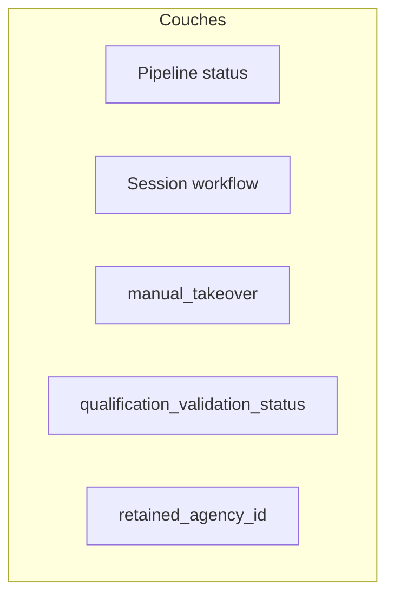
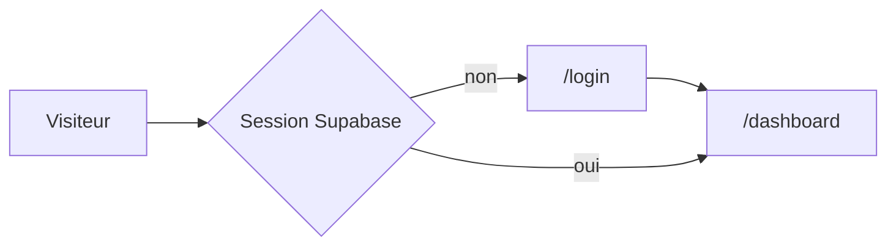
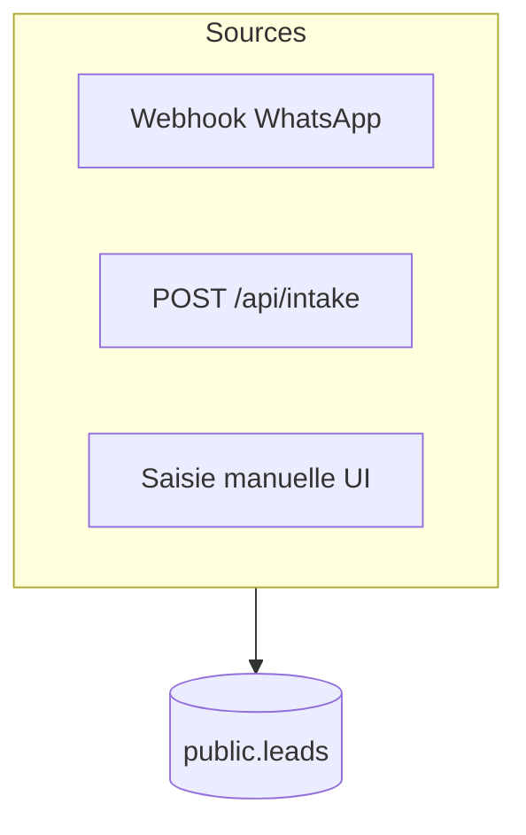
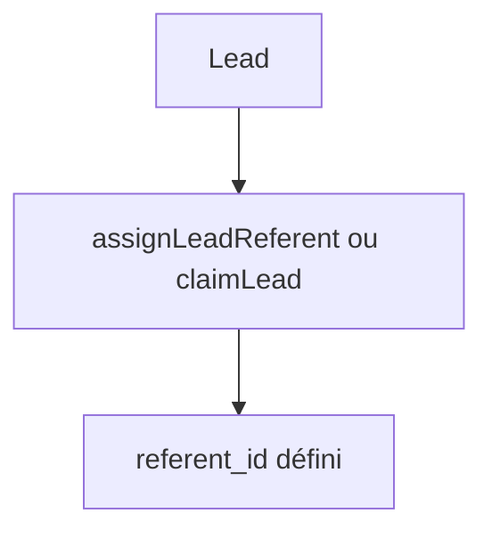
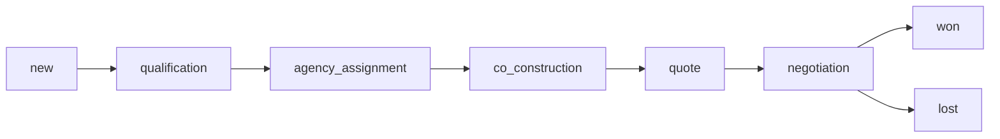
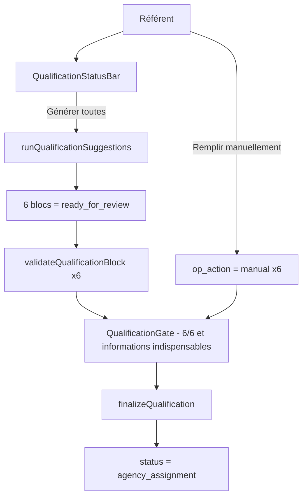

# Parcours utilisateur, pipeline et garde-fous (doc vivante)

| Champ | Valeur |
|-------|--------|
| **Périmètre** | Cockpit lead (`/leads/[id]`), liste leads, workflow voyageur (`/leads/[id]/workflow`), statuts pipeline Supabase, gates brief, intake, webhooks ; effets **côté opérateur** des politiques RLS. |
| **Dernière revue** | 2026-10-05 — Import manuel analysé et relu, qualification logistique partagée, composer email intégré à BO3, consultations préparées avant envoi et historique des mails. Voir les parcours ci-dessous et [`REFONTE_V3.md`](./REFONTE_V3.md). Les sections v2 plus bas décrivent les écrans historiques ; `/leads/[id]/workflow` redirige vers BO3. |
| **Sources de vérité** | Runtime : `projet-actions.ts`, `manual-import-actions.ts`, `email-actions.ts`, `qualification-details-actions.ts`, `lead-qualification-completeness.ts`, `workflow-actions.ts`, `lead-brief-gate.ts` et migrations mailing. Spec produit : [`PRODUCT_SPEC.md`](./PRODUCT_SPEC.md). |

## Parcours v3 — de la trame du site au dossier gagné (depuis le 27/09/2026)

Le site peut envoyer une **trame** structurée à `POST /api/intake`. Un email ou message peut aussi être importé manuellement, puis qualifié dans les champs du dossier. La trame du site n'est pas obligatoire : le brief peut être préparé dès que les informations indispensables sont confirmées. Détail des données : [`REFONTE_V3.md`](./REFONTE_V3.md).

```mermaid
flowchart LR
  A[À compléter] -->|réponses client et faits confirmés| R[Reçu]
  R -->|genererBrief| B[Brief prêt]
  B -->|preparerEmailAgence| D[Brouillon agence]
  D -->|envoi explicite ou envoi externe déclaré| E[Envoyé aux agences]
  E -->|saisirProposition / retenirProposition| P[Proposition]
  P -->|convertirProposition puis envoyerProposition| PR[Proposée]
  PR -->|marquerGagne / marquerPerdu| C[Clos]
```

- **Étapes affichées** : dérivées de `leads.status` et du contenu du dossier (`statutDe()` dans `src/lib/bo3/load.ts`). L'enum de la base ne change pas.
- **Première réponse sous 48 h** : le premier mail `welcome` ou `qualification` finalisé par le composer compte comme réponse, y compris un envoi externe déclaré. La RPC ajoute au journal `email_sent` ou `email_sent_externally`, avec le contenu édité et `payload.email_kind` ; BO3 lit ces événements pour arrêter l'horloge. Les événements historiques `first_response` / `traveler_link_sent` restent reconnus. L'accusé automatique du site (`ack_sent`, si activé) ne compte pas comme réponse humaine.
- **Garde-fou « Reçu → Brief prêt »** : `analyzeLeadQualification()` vérifie les informations de chiffrage dans les faits confirmés, réponses voyageur et trame. Un budget « À définir » ou une simple catégorie de budget ne suffit pas. Le moteur est partagé par BO3, la génération du brief et le mailing ; les champs manquants restent à demander.
- **Brief anonyme et fidèle** : le brief reprend les notes supplémentaires reformatées, les options de parcours et les informations confirmées. Les noms, emails, téléphones et profils sociaux du voyageur sont masqués ; le serveur refuse un mail agence édité qui réintroduit des coordonnées ou une identité.
- **Préparation agence distincte de l'envoi** : « Confier à une agence » crée/réutilise une consultation `pending_send`, `brief_sent_at = null`, puis ouvre son composer. Les anciens boutons déclarant immédiatement l'envoi ne font plus partie du flux de la fiche.
- **Réponse agence sous 48 h** : l'horloge démarre seulement lorsque la RPC finalise l'envoi du mail agence et renseigne `brief_sent_at`. Un brouillon ne déclenche ni délai, ni accusé attendu, ni relance, ni saisie de proposition.
- **Proposition Direction l'Algérie** : le devis d'une agence est converti (titre, lignes, prix par personne, validité, mention du partenariat), puis envoyé au voyageur. Le voyageur ne reçoit jamais le devis de l'agence tel quel.
- **Écritures** : les actions de `projet-actions.ts` écrivent le statut directement, **conditionné au statut de départ** (jamais de retour en arrière). Elles ne passent pas par `updateLeadStatus` / `assertLeadStatusTransition`. La RLS s'applique toujours : un dossier sans référent est pris par l'opérateur qui agit (`prendreDossier`).

### Import manuel d'un email ou message

1. Depuis l'import manuel, coller le message complet et choisir son canal d'origine. `analyzeManualLeadMessage()` répartit les faits explicites dans les champs et propose une retranscription complète, aérée, dans les notes supplémentaires du voyage. Cette analyse n'insère rien et n'envoie aucun email.
2. Relire et modifier le contact, le titre, les destinations/options, groupe, dates, hébergements, budget, vols, chambres, contraintes, notes et langue des emails client. La langue est celle du message original (`fr`/`en`), même si la retranscription interne est en français ; elle ne se déduit pas de la nationalité. Si l'IA est indisponible, le préremplissage conservateur est signalé et reste éditable.
3. Confirmer la relecture puis créer via `createLeadFromManualMessage()`. L'opérateur connecté devient explicitement le référent du dossier. Le message original est conservé intégralement dans `intake_payload.source_message`, distinct des notes reformatées ; le UUID de soumission protège des imports répétés avec le même identifiant.
4. Les absences restent des absences : pas d'année inférée à partir de la date de réception, pas de groupe transformé en « 1 adulte / 0 enfant », pas de devise ou base de budget inventée. « Entre amis » ne donne pas un nombre ; « solo » explicite permet 1 adulte / 0 enfant. Les montants en devise étrangère restent dans les faits et le texte, sans taux de conversion inventé dans les colonnes financières EUR.

### Qualification et composer email

- « Écrire la première réponse » / « Ouvrir le brouillon » ouvrent le modèle `welcome`. L'onglet Qualification et « Demander ce qui manque » ouvrent `qualification`. Chaque consultation ouvre son `agency_brief` lié au dossier et à l'agence.
- Les modèles client sont en français ou anglais, le brief agence en français. Ils utilisent le logo et la mise en page Direction l'Algérie. L'opérateur modifie l'objet et le texte ; l'aperçu HTML, la copie du texte/HTML/email mis en forme, le téléchargement HTML et l'envoi reprennent ce contenu édité.
- `saveLeadEmailDraft()` conserve le brouillon dans `lead_email_messages`. Réactualiser le modèle depuis le dossier remplace son texte après confirmation ; les réponses du client sont enregistrées dans « Compléter les informations pour le brief agence » puis les questions peuvent être régénérées.
- Les premières questions manquantes concernent les **vols** (et aéroport si vols à proposer), puis le **nombre total et la composition adultes/enfants**, les **âges des enfants au départ**, puis la **répartition et la capacité des chambres**. Suivent dates avec année et durée, montant/devise/base du budget et inclusion/exclusion des vols, hébergement et itinéraire. Les données déjà confirmées ne sont pas demandées à nouveau.
- Les questions s'adaptent au projet : bivouac seul ou expédition pédestre ne déclenchent pas une demande de chambres d'hôtel ; une expédition demande sa stratégie d'eau et son couchage/matériel. Arrivée/départ, prestations et contraintes restent des précisions complémentaires visibles dans le brief.
- L'enregistrement/envoi exige un dossier non archivé, un référent assigné et l'utilisateur référent ou admin, ainsi qu'une adresse destinataire valide. L'envoi agence vérifie aussi consultation/destinataire, anonymisation et informations indispensables.
- **Aucun envoi implicite au lancement du workflow** : `launchWorkflowAi` / `launchWorkflowManual` créent la session ; leurs anciens déclenchements de mails ont été retirés. Seul « Envoyer depuis Travel Lead » appelle Resend. Si le mail est envoyé depuis une autre messagerie, l'opérateur confirme explicitement « J'ai envoyé depuis ma messagerie ».
- Envoi confirmé par le prestataire (`sent`) et déclaration externe (`external`) restent distincts dans l'historique. La sauvegarde et l'envoi contrôlent la révision du brouillon ; un clic concurrent ne peut pas envoyer une autre version. Un état `sending` dont la livraison est incertaine doit être vérifié auprès du prestataire avant toute nouvelle tentative. Le contenu d'un message déjà traité est conservé ; un nouvel envoi utilise un nouveau brouillon.

### Migrations nécessaires au mailing

Appliquer dans l'ordre : `20261005140000_lead_email_messages.sql` (table, RLS, historique et finalisation), `20261005143000_lead_email_concurrency.sql` (révision attendue), `20261005150000_lead_email_bo3_journal.sql` (journal BO3, première réponse client et transitions après envoi), `20261005152000_lead_email_delivery_guard.sql` (transmission unique, blocage des envois incertains), `20261005153000_lead_email_consultation_guard.sql` (préparations simultanées). Un mail complémentaire conserve le statut et la date initiale de consultation. Copier/exporter un modèle ne remplace pas l'enregistrement d'un envoi.

## Carte des zones code (à re-vérifier quand le flux change)

- `src/app/(dashboard)/leads/actions.ts` — pipeline, référent, gates
- `src/app/(dashboard)/leads/workflow-actions.ts` — session workflow, reset
- `src/app/(dashboard)/leads/ai-actions.ts` — IA, `manual_takeover`
- `src/lib/lead-brief-gate.ts` — brief exploitable, qualification sign-off
- `src/lib/lead-qualification-completeness.ts` — questions manquantes et informations nécessaires au brief
- `src/app/(dashboard)/leads/manual-import-actions.ts` et `src/lib/manual-lead-import.ts` — analyse, relecture et import fidèle
- `src/app/(dashboard)/leads/email-actions.ts`, `qualification-details-actions.ts` — brouillons/envois explicites, faits logistiques
- `src/components/bo3/fiche.tsx`, `src/components/leads/lead-email-composer.tsx`, `src/components/leads/qualification/lead-logistics-editor.tsx` — chaîne de traitement et éditeurs
- `src/components/leads/lead-cockpit-shell.tsx`, `lead-cockpit-pipeline.tsx`, `lead-cockpit-bottom-nav.tsx`
- `src/app/api/intake/`, `src/app/api/whatsapp/webhook/`
- `supabase/migrations/`, [`RLS_PROD_CHECKLIST.md`](./RLS_PROD_CHECKLIST.md)

---

## Modèle d’état multi-couches

Un dossier combine plusieurs dimensions qui évoluent **indépendamment** dans la base :

1. **Statut pipeline** — `leads.status` (`new` → … → `won` / `lost`).
2. **Session workflow voyageur** — `workflow_launched_at`, `workflow_mode`, `workflow_run_ref`, `workflow_launched_by`.
3. **Reprise manuelle IA** — `manual_takeover`.
4. **Validation qualification** — `qualification_validation_status`.
5. **Agence retenue** — `retained_agency_id` (après assignation).

```mermaid
flowchart TB
  subgraph layers [Couches]
    P[Pipeline status]
    W[Session workflow]
    M[manual_takeover]
    Q[qualification_validation_status]
    A[retained_agency_id]
  end
```

---

## Parcours : authentification

```mermaid
flowchart LR
  U[Visiteur] --> L{Session Supabase}
  L -->|non| LP["/login"]
  LP --> D["/dashboard"]
  L -->|oui| D
```

---

## Parcours : entrée d’un lead

```mermaid
flowchart TB
  subgraph sources [Sources]
    W[Webhook WhatsApp]
    I["POST /api/intake"]
    M[Saisie manuelle UI]
  end
  sources --> DB[(public.leads)]
```

---

## Parcours : référent (opérateur travel desk)

- **Allouer** : `assignLeadReferent` ; **prendre** : `claimLead`.
- **Import manuel** : `createLeadFromManualMessage` affecte explicitement le dossier à l'opérateur connecté ; BO3 prend un dossier de pool via `prendreDossier` lors d'une action opérateur. Le composer n'enregistre ni n'envoie un mail d'un dossier sans référent.
- Tant que `referent_id` est vide, le passage hors `new` est bloqué (`assertLeadStatusTransition`).

```mermaid
flowchart TB
  L[Lead]
  L --> AR[assignLeadReferent ou claimLead]
  AR --> R[referent_id défini]
```

---

## Parcours : pipeline linéaire (intention produit)

Ordre : `LEAD_PIPELINE` dans `src/lib/mock-leads.ts`.

```mermaid
flowchart LR
  new --> qual[qualification]
  qual --> aa[agency_assignment]
  aa --> co[co_construction]
  co --> q[quote]
  q --> neg[negotiation]
  neg --> won
  neg --> lost
```

### Vérité serveur : `updateLeadStatus` vs `moveLeadPipelineStep`

- **`moveLeadPipelineStep`** : avance ou recule **d’une seule** étape — aligné avec le parcours linéaire.
- **`updateLeadStatus`** : accepte un statut cible **quelconque** tant que les garde-fous passent — d’où l’écart historique avec les schémas (voir conflit **C1** et correctif dans [`CODE_PATCHES_P0_FROM_PLAN.md`](./CODE_PATCHES_P0_FROM_PLAN.md)).

---

## Parcours : qualification v2 — 6 blocs thématiques

> **v2 (2026-05-01)** — Remplace le workspace v1 (champs libres + statut global). Composant : `src/components/leads/qualification/lead-qualification-workspace.tsx`.

### 6 blocs structurés

| Bloc | Description | Sections |
|------|-------------|----------|
| `vibes` | Ambiance & type de voyage | expériences, rythme, structure |
| `group` | Composition du groupe | taille, profil, niveau physique |
| `timing` | Temporalité | durée, saison, flexibilité |
| `stay` | Hébergement | type, confort |
| `highlights` | Incontournables & contraintes | must-see, évitements, contraintes |
| `budget` | Budget | fourchette, valeur, inclusions |

### 4 états d'un bloc

| État (`ai_status` / `op_action`) | Affichage |
|----------------------------------|-----------|
| `pending` + `op_action=null` | En attente (gris) — boutons "Suggestions IA" ou "Remplir manuellement" |
| `in_progress` + `op_action=null` | IA en cours (ambre, spinner) |
| `ready_for_review` + `op_action=null` | Prêt à valider (bleu) — chips IA affichées, actions Confirmer/Ajuster/Manuel |
| tout + `op_action!=null` | Validé (vert) — chips figées, bouton "Modifier" |

### Actions disponibles (v2)

| Action | Server action | Effet |
|--------|--------------|-------|
| Générer suggestions | `runQualificationSuggestions` | OpenAI → suggestions chips par bloc, confiance, sections manquantes |
| Valider un bloc | `validateQualificationBlock` | `op_action = confirmed/adjusted/manual` + `op_validated_at` |
| Mettre à jour sélections | `updateBlockSelections` | Sélections intermédiaires sans validation |
| Rouvrir un bloc | `reopenQualificationBlock` | Reset `op_action=null`, conserve sélections |
| Valider la qualification | `finalizeQualification` | Vérifie 6 blocs validés et informations indispensables complètes → `status = agency_assignment` |

**Variable d'env requise :** `OPENAI_API_KEY` (server-only).

```mermaid
flowchart TB
  R[Référent] --> SB[QualificationStatusBar]
  SB -->|"Générer toutes"| IA[runQualificationSuggestions]
  IA --> BL["6 blocs = ready_for_review"]
  BL --> VAL[validateQualificationBlock x6]
  VAL --> GATE[QualificationGate - 6/6 et informations indispensables]
  GATE --> FIN[finalizeQualification]
  FIN --> AA[status = agency_assignment]
  R -->|"Remplir manuellement"| MANUAL["op_action = manual x6"]
  MANUAL --> GATE
```

### Lancement workflow historique

- `launchWorkflowAi` / `launchWorkflowManual` (`workflow-actions.ts`) ; seul le **référent** du dossier.
- Le lancement ne déclenche plus d'email : accusé et qualification sont relus, enregistrés et envoyés explicitement depuis le composer.
- **Reset session** : `resetWorkflowVoyageurSession`.

---

## Parcours : gate « brief prêt » → assignation agence

- **Condition partagée** : `analyzeLeadQualification().readyForAgencyBrief` doit être vrai. Le mode manuel, les chips de budget et la validation des blocs ne dispensent pas de renseigner les informations indispensables.
- **v2** : après ce contrôle, `isLeadBriefExploitable` vérifie `allBlocksValidated(lead.qualification_blocks)`. Tous les 6 blocs doivent avoir `op_action !== null`.
- **Fallback v1** : si `qualification_blocks` est absent (leads legacy), la gate utilise la checklist 8-champs + `qualification_validation_status`.
- **BO3** : `genererBrief` accepte les faits complets sans trame du site ; `preparerEmailAgence` prépare seulement la consultation, et l'envoi agence du composer revérifie les informations avant transmission/finalisation.
- Implémentation : `isLeadBriefExploitable` / `getBriefGateBlockMessage` (`lead-brief-gate.ts`) + `assertBriefExploitableBeforeAgencyAssignment` (`actions.ts`) sur `qualification` → `agency_assignment`.

---

## Parcours : après assignation agence

- `retained_agency_id` requis avant d’aller au-delà de `agency_assignment` (`assertLeadStatusTransition`).
- Sortie de `co_construction` vers `quote` : proposition approuvée liée à un devis ou devis existant (`assertCoConstructionApprovedIfLeaving`).

---

## Conflits connus (C1–C8)

| ID | Sujet | Mitigation / correctif |
|----|--------|-------------------------|
| C1 | Sauts d’étape via `updateLeadStatus` | Adjacent strict hors admin — voir patch doc |
| C2 | Session workflow alors que le statut a quitté `qualification` | Nettoyer champs session à la sortie de `qualification` — voir patch doc |
| C3 | Changement de référent vs session | Clear session à la réassignation — voir patch doc |
| C4 | `manual_takeover` vs tâches async | Matrice à documenter par audit code ; respect takeover sur chaque écriture |
| C5 | Brief gate / mode manuel / hybride | Copie UX + règles dans `lead-brief-gate.ts` |
| C6 | Reset session et `manual_takeover` | Déjà aligné dans `resetWorkflowVoyageurSession` (`manual_takeover: false`) |
| C7 | Doc vs code (`triggerQualificationConversation`) | Voir [`IMPLEMENTATION_PENDING_V2.md`](./IMPLEMENTATION_PENDING_V2.md) |
| C8 | RLS vs Server Actions | [`RLS_PROD_CHECKLIST.md`](./RLS_PROD_CHECKLIST.md) |

---

## Changelog parcours (récent)

| Date | Changement |
|------|------------|
| 2026-10-05 | Import manuel avec analyse éditable, notes fidèles/source originale distinctes et référent explicite ; moteur commun de qualification logistique ; templates DA client FR/EN et agence FR, brouillons et historique ; consultations `pending_send` avant envoi explicite/externe ; journal BO3 et horloges déclenchées uniquement après finalisation. |
| 2026-04-20 | Création de ce document ; correctifs P0 mergés dans le code (`actions.ts`, cockpit pipeline, `lead-supabase-pipeline`). |
| 2026-04-20 | Refonte UI/UX complète : inbox, cockpit 3 colonnes, dashboard pilotage, liste leads. |
| 2026-04-20 | Workspace qualification unifié : `LeadQualificationWorkspace` + agent Claude Haiku + 3 server actions. Migration `destination_main`, `travel_desire_narrative`, `qualification_notes`. |
| 2026-04-21 | Back Office v2 : fix sidebar sticky (layout), sparklines + top agencies réels dans Pilotage business, module Gestion agences v1 (CRUD, contacts, logos, détail 5 sections). |
| 2026-09-27 | Back office v3 : file de travail `/inbox`, fiche projet `/leads/[id]` pilotée par la trame, 7 étapes affichées, horloges 48 h voyageur et agence, brief anonyme, proposition Direction l'Algérie (PDF v3), lien voyageur raccourci `/q/<token>?champs=`. `/metrics` → `/dashboard`, `/leads/[id]/workflow` → `/leads/[id]`, ancienne liste des agences sous `/agencies/gestion`. Suppression du déclencheur en double `leads_sync_contact`, qui empêchait tout passage en gagné ou perdu. |

---

---

## Parcours admin — Gestion des agences

### Créer une agence
1. `/agencies` → bouton "Nouvelle agence" → drawer s’ouvre
2. Remplir : raison sociale (obligatoire), type, pays, ville (obligatoires), contact principal (obligatoire en création)
3. Submit → `createPartnerAgency()` → agence créée en `pending_validation`
4. Apparaît dans la grille ; clic → `/agencies/[id]`

### Modifier une agence
1. `/agencies/[id]` → bouton "Modifier" → drawer pré-rempli
2. Modification → `updateAgency()` — champs contacts non modifiés via ce drawer (utiliser section Contacts)
3. Changement de statut via menu kebab → `updateAgencyStatus()`

### Gérer les contacts
1. Section "Contacts" de la fiche → bouton "+ Ajouter un contact"
2. `addAgencyContact()` — le premier contact créé n’est pas automatiquement primaire
3. "Définir comme principal" → `setPrimaryAgencyContact()` — reset l’ancien primary puis set le nouveau (deux updates, service role)
4. Impossible de supprimer le contact principal sans en nommer un autre d’abord

### Supprimer une agence
**Guard de suppression (sans force) :**
- Si l’agence a des leads avec `retained_agency_id` actifs (statut ≠ won/lost) → bloqué
- Si l’agence a des consultations non terminées (≠ declined/quote_received) → bloqué
- `deleteAgency(id)` retourne `{ blocked: true, activeLeads: N, activeConsultations: M }`
- Le dialog affiche le détail d’impact, propose "Annuler" ou "Détacher et supprimer quand même"

**Force delete (admin) :**
- `deleteAgency(id, { force: true })` :
  1. Détache `retained_agency_id = null` sur les leads actifs
  2. Log `activities.kind = ‘agency_removed’` sur chaque lead impacté
  3. Archive les consultations actives → status `declined`
  4. Supprime l’agence

**RLS :** mutations sur `agencies` et `agency_contacts` réservées aux admins (`is_app_admin()`). Les référents peuvent voir les agences mais pas les modifier.

### Conflits agences (CA1–CA3)

| ID | Sujet | Mitigation |
|----|-------|------------|
| CA1 | Suppression agence avec leads actifs | Guard bloquant + force delete explicite |
| CA2 | Deux contacts `is_primary = true` | Unique index partiel `agency_contacts_primary_unique` |
| CA3 | Logo upload concurrent (2 onglets) | Dernière écriture gagne — acceptable |

---

## Parcours — Lien voyageur & requalification (`/q/<token>`)

Alternative à la qualification par email long : une page publique où le voyageur complète son projet.

1. **Génération** (opérateur, cockpit → dossier) : bouton « Lien voyageur » → `generateTravelerLink(leadId)` alloue `public_token` (uuid, 30 j) et retourne `https://app.directionlalgerie.com/q/<token>`. L'opérateur le colle dans son email au client (envoi manuel, boîte DA).
2. **Complétion** (voyageur) : `/q/<token>` (mobile-first, hors auth) affiche la synthèse du projet (jamais email/téléphone) + 6 sections → `POST /api/q/<token>` écrit `traveler_responses` (JSONB) + `traveler_responses_submitted_at`.
3. **Lecture** (opérateur) : panneau « Réponses voyageur » (lecture seule) dans le dossier. Pas d'auto-application aux blocs `qualification_blocks` en v1.

**Variante v3, lien raccourci** : `demanderManque` produit `/q/<token>?champs=dates,groupe,budget,lieux` limité à ce qui manque à la trame. La page affiche alors un formulaire court, posté sur `POST /api/q/<token>/champs`, qui complète `ai_qualification_payload.trame_v3` et ajoute une activité `traveler_answers` au fil du dossier. Sans `champs`, le questionnaire long ci-dessus reste en place.

Règles : soumission **unique** (`409` si déjà soumis) ; **régénérer** le lien réouvre la soumission (`submitted_at → null`) en conservant les réponses comme pré-remplissage ; token invalide/expiré → page « lien expiré » sans fuite d'info. Service role uniquement (page RSC + route API) ; le middleware ne rafraîchit pas la session sur `/q/*`. Colonnes ajoutées au lead via une requête isolée (tolère l'absence de migration). Spec complète : [`SPEC_PAGE_VOYAGEUR_REQUALIFICATION.md`](./SPEC_PAGE_VOYAGEUR_REQUALIFICATION.md).

---

## Règle d’évolution (obligatoire)

Toute PR qui modifie **pipeline**, **workflow voyageur**, **gates brief**, **référent**, **intake** ou **RLS** sur les leads doit **mettre à jour ce fichier** (diagrammes, tableau C1–C8, ou changelog) dans la **même PR**, sauf urgence avec PR de suivi sous 48 h et todo explicite.

Voir aussi [`CONTRIBUTING.md`](../CONTRIBUTING.md).
