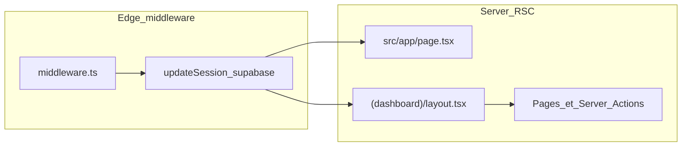

# Architecture applicative

## Vue d’ensemble

Application **Next.js App Router** avec pages serveur, **authentification Supabase** (session via cookies), données **Postgres** exposées au client via le client Supabase **anon** (sécurité portée par **RLS**).

## Flux requête / session

1. **Middleware** ([`middleware.ts`](../../middleware.ts)) intercepte les chemins (hors assets statiques) et appelle `updateSession`.
2. **`updateSession`** ([`src/lib/supabase/middleware.ts`](../../src/lib/supabase/middleware.ts)) crée un client Supabase SSR, lit `getUser()`, et réécrit les cookies de session sur la réponse.
3. **Racine** ([`src/app/page.tsx`](../../src/app/page.tsx)) : si utilisateur connecté → redirection vers `/dashboard`, sinon → `/login`.
4. **Layout dashboard** ([`src/app/(dashboard)/layout.tsx`](../../src/app/(dashboard)/layout.tsx)) : `createClient()` côté serveur, `getUser()` ; si pas d’utilisateur → `redirect("/login")`. Le segment est marqué `dynamic = "force-dynamic"` et `revalidate = 0` pour refléter la session à chaque requête.

## Clients Supabase

- **Serveur** : [`src/lib/supabase/server.ts`](../../src/lib/supabase/server.ts) — utilisé dans les layouts/pages server et les server actions.
- **Client navigateur** : [`src/lib/supabase/client.ts`](../../src/lib/supabase/client.ts) — composants client interactifs.
- **Middleware** : construction inline dans [`src/lib/supabase/middleware.ts`](../../src/lib/supabase/middleware.ts).

Si `NEXT_PUBLIC_SUPABASE_URL` ou `NEXT_PUBLIC_SUPABASE_ANON_KEY` manquent, le middleware retourne une réponse sans erreur explicite (session non rafraîchie).

## Structure `src/`

| Zone | Rôle indicatif |
|------|----------------|
| [`src/app/`](../../src/app/) | Routes App Router, layouts, server actions par domaine. |
| [`src/app/api/intake/route.ts`](../../src/app/api/intake/route.ts) | Intake public (CORS + optionnellement secret) → création lead côté serveur (`service_role`). |
| [`src/app/api/whatsapp/webhook/route.ts`](../../src/app/api/whatsapp/webhook/route.ts) | Webhook Meta (challenge + événements). |
| [`src/components/`](../../src/components/) | UI réutilisable (sidebar, formulaires lead, modales, etc.). |
| [`src/context/`](../../src/context/) | React context (ex. `LeadsDemoProvider` pour état client liste / Kanban + refresh serveur). |
| [`src/lib/`](../../src/lib/) | Mappers Supabase, PDF, filtres file leads, champs CRM, utilitaires. |
| [`src/lib/ai/`](../../src/lib/ai/) | Prompts, parsing JSON, agent OpenAI (`agent.ts`, `prompts/qualification.ts`, `agency-scoring.ts`, `proposal-comparison.ts`). |

## Points d’attention pour un audit

- **Auth** : contrôle d’accès UI surtout via layout dashboard ; la **sécurité réelle** repose sur **RLS** Supabase (voir [DATA_SUPABASE.md](./DATA_SUPABASE.md) et [RLS_PROD_CHECKLIST.md](../RLS_PROD_CHECKLIST.md)).
- **PDF** : route API dédiée (voir [ROUTES_AND_FEATURES.md](./ROUTES_AND_FEATURES.md)) — vérifier autorisations et fuite de données côté PDF ; stockage optionnel bucket `quote_pdfs` (migrations).
- **Données leads** : agences et leads passent par Supabase (pages server + actions) ; le contexte leads sert aux filtres / mutations optimistes côté client.
- **IA** : tout appel modèle doit rester **serveur** (server actions ou routes API) ; ne jamais exposer `OPENAI_API_KEY` en `NEXT_PUBLIC_*`.
- **Intake / WhatsApp** : utilisent `SUPABASE_SERVICE_ROLE_KEY` — surface d’attaque hors session utilisateur ; valider CORS, secrets, et idempotence (`submission_id`).
