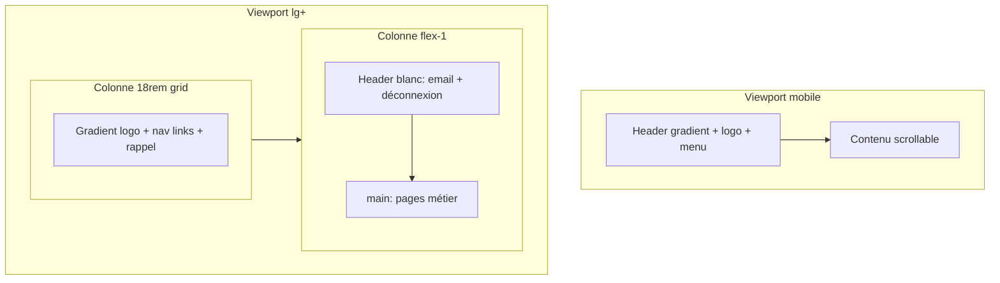

# UI, layout et rendu visuel — Travel Lead Desk

Ce document sert à **reconstituer mentalement l’interface** (couleurs, grilles, panneaux, hiérarchie) sans ouvrir le navigateur. Les valeurs ci-dessous proviennent de `src/app/globals.css`, `src/app/layout.tsx`, `src/app/(dashboard)/layout.tsx` et des composants cités.

---

## 1. Direction artistique (résumé)

- **Ambiance** : application interne type *SaaS clair* — fond très léger, surfaces blanches, bordures discrètes, **accent marine / anthracite** (`#182b35`, nommé *steel* dans le thème) pour la marque et les états actifs.
- **Contraste** : texte principal quasi noir sur fond `#fafafa` ; texte secondaire gris-bleu (`muted-foreground`).
- **Marque** : bandeaux dégradés sombres (`#0f1c24` → `#182b35`) pour le **bloc logo** (sidebar, drawer mobile) et la **barre mobile** ; logo PNG blanc (URL dans `src/lib/brand-assets.ts`).
- **Typo** : **Poppins** (corps, UI, labels) ; **Cormorant Garamond** (titres « éditoriaux » sur la fiche lead via `font-display`).

---

## 2. Tokens CSS (`:root` + `@theme inline`)

Fichier : [`src/app/globals.css`](../../src/app/globals.css).

| Token / classe Tailwind | Rôle visuel | Valeur |
|-------------------------|-------------|--------|
| `background` / `bg-background` | Fond global page | `#fafafa` |
| `foreground` / `text-foreground` | Texte principal | `#0b0c0d` |
| `panel` / `bg-panel` | Cartes, zones principales | `#ffffff` |
| `panel-muted` / `bg-panel-muted` | Champs, lignes de tableau, fonds secondaires | `#f4f7fa` |
| `border` / `border-border` | Filets, contours | `#e6ebef` |
| `steel` / `text-steel`, `ring-steel` | Accent DA, labels d’étape, focus ring | `#182b35` |
| `steel-ink` | Texte sur fond steel (ex. nav active) | `#f3f7fa` |
| `accent` | Aligné sur steel | `#182b35` |
| `muted-foreground` | Sous-textes, icônes inactives | `#60727c` |

**Focus formulaires** : `focus:ring-2 focus:ring-steel/25` sur les inputs (bordure `border-border`, fond souvent `bg-panel-muted`).

**Coins** : la plupart des panneaux utilisent `rounded-md` ; la nav sidebar utilise des liens **`rounded-none`** avec bordure pleine pour un look « onglet / ruban ».

---

## 3. Typographie et racine HTML

Fichier : [`src/app/layout.tsx`](../../src/app/layout.tsx).

- `lang="fr"`, `antialiased`, `h-full` sur `<html>`.
- `body` : `min-h-full bg-background font-sans text-foreground`.
- Polices Next Font : **Poppins** (400–800) → `--font-poppins` ; **Cormorant Garamond** (400, 600, 700 + italic) → `--font-cormorant`.
- Classe utilitaire `.font-display` : titres serif sur l’espace lead (ex. titre d’étape dans `lead-supabase-stage-workspace.tsx`).

---

## 4. Coque dashboard (desktop)

Fichier : [`src/app/(dashboard)/layout.tsx`](../../src/app/(dashboard)/layout.tsx).

| Zone | Comportement visuel / structure |
|------|----------------------------------|
| Conteneur global | `min-h-screen overflow-x-hidden` |
| Mobile | **`DashboardMobileNav`** visible en `<lg>` (header gradient + menu hamburger) |
| Grille `lg` | `lg:grid lg:grid-cols-[18rem_minmax(0,1fr)]` — colonne gauche **18rem** pour la grille, mais le **sidebar** lui-même est **`lg:w-72`** (288px) dans `SidebarNav` : la colonne accueille le aside sticky. |
| Colonne contenu | `flex min-h-screen min-w-0 flex-col` — évite débordement horizontal (`min-w-0` important pour tableaux / Kanban). |
| **Header** (haut de zone contenu) | `border-b border-neutral-200 bg-white`, email à gauche (`text-neutral-600`), **SignOut** à droite, padding `px-4 py-3` → `lg:px-8`. |
| **Main** | `flex-1` padding `px-4 py-5` → `lg:px-8 lg:py-8` |

**Note** : le header du layout dashboard est **blanc / neutre** ; le header **gradient sombre** est réservé au **mobile** (`dashboard-mobile-nav.tsx`).

---

## 5. Sidebar (desktop)

Fichier : [`src/components/sidebar-nav.tsx`](../../src/components/sidebar-nav.tsx).

- **Visible** : `hidden … lg:flex` — masquée sur petit écran (remplacée par le drawer mobile).
- **Position** : `lg:sticky lg:top-0 lg:max-h-[100dvh] lg:overflow-y-auto`, bordure droite `lg:border-r`, fond `bg-panel`.
- **Haut** : `BrandLogoBlock variant="sidebar"` (voir §7).
- **Sous le logo** : padding `px-5 py-6`, **`GlobalSearch`** (caché sur mobile dans ce bloc car sidebar cachée).
- **Liens nav** : pour chaque entrée `dashboardNavItems`, lien avec bordure :
  - **Actif** : `border-[#182b35] bg-[#182b35]`, texte et icône `#f3f7fa`.
  - **Inactif** : `bg-panel-muted`, hover `hover:border-border hover:bg-panel`.
- **Encadré « Rappel »** en bas : `rounded-md border bg-panel-muted p-4`, titre uppercase petit, texte rappel métier *Interface unique voyageur ↔ Direction l’Algérie.*

---

## 6. Navigation mobile

Fichier : [`src/components/dashboard-mobile-nav.tsx`](../../src/components/dashboard-mobile-nav.tsx).

- **Barre supérieure** (`lg:hidden`) : `sticky top-0 z-40`, gradient `from-[#0f1c24] to-[#182b35]`, bordure basse `border-white/10`, logo compact + bouton menu (bordure `border-white/35`, fond `bg-white/5`, icône `#F3F7FA`).
- **Overlay drawer** : overlay `bg-[#0b1419]/55 backdrop-blur-[2px]`, panneau droit `w-[min(100%,20rem)]`, `bg-panel`, ombre légère.
- **Liens** : mêmes états actif / inactif que la sidebar desktop.
- **Pied drawer** : rappel interface unique, `text-xs text-muted-foreground`.

---

## 7. Bloc marque (logo)

Fichier : [`src/components/brand-logo-block.tsx`](../../src/components/brand-logo-block.tsx).

- Conteneur logo : **`bg-gradient-to-b from-[#0f1c24] to-[#182b35]`**, `border-b border-white/10`.
- Sous-titre : `Travel Lead Desk` en uppercase très petit, `tracking-[0.26em] text-white/72`.
- Variante **sidebar** : phrase d’accroche interne sous le logo (`text-white/78`).
- Logo image : `DIRECTION_ALG_LOGO_URL` dans [`src/lib/brand-assets.ts`](../../src/lib/brand-assets.ts) (PNG Squarespace CDN, fond transparent — rendu clair sur bandeau sombre).

---

## 8. Vocabulaire des « panneaux » dans l’app

Les écrans métier combinent systématiquement :

| Pattern | Usage typique |
|---------|----------------|
| `rounded-md border border-border bg-panel p-4 sm:p-6` | Section principale (fiche lead, IA ops, étape workspace) |
| `rounded-md border border-border bg-panel-muted/30` (ou `/40`, `/80`) | Sous-blocs, zones de formulaire atténuées |
| `border border-dashed border-border bg-panel-muted/50` | Zones vides / placeholders |
| `shadow-sm` | Cartes Kanban, petites cartes |
| `border-[#182b35]/25` + `bg-panel` | Encadré « étape active » sur la fiche lead (`lead-supabase-stage-workspace`) |
| `border-[#182b35]` sur boutons secondaires | Actions liées à la marque (ex. panneau devis) |

**Modales** : `max-w-2xl`, `max-h-[min(92vh,…)]`, `bg-panel shadow-lg border border-border`, footer parfois `border-t`.

---

## 9. Page Leads (liste / Kanban)

Fichier principal UI : [`src/app/(dashboard)/leads/leads-page-inner.tsx`](../../src/app/(dashboard)/leads/leads-page-inner.tsx).

- **Toggle vue** : `inline-flex rounded-md border bg-panel-muted p-0.5` — onglets liste / Kanban avec l’onglet actif `bg-panel shadow-sm`.
- **Barre filtres** : panneau `bg-panel` bordé, chips file / statut avec états `bg-panel-muted` vs `bg-panel`.
- **Table liste** : `section` `rounded-md border bg-panel`, en-tête `thead` `bg-panel-muted/80`, lignes `hover:bg-panel-muted/50`.
- **Kanban** : [`src/components/leads-kanban-board.tsx`](../../src/components/leads-kanban-board.tsx) — colonnes `w-[min(100%,17.5rem)]`, en-tête colonne `bg-panel`, compteur pastille `bg-panel-muted`, cartes `bg-panel shadow-sm`, **select d’étape** en bas de carte.

---

## 10. Fiche lead (détail) — cockpit v4

Assemblage : [`LeadCockpitShell`](../../src/components/leads/lead-cockpit-shell.tsx) dans [`lead-detail-supabase.tsx`](../../src/app/(dashboard)/leads/[id]/lead-detail-supabase.tsx) (idem route [`workflow/page.tsx`](../../src/app/(dashboard)/leads/[id]/workflow/page.tsx) avec `showFicheLink={false}`).

1. **Bande** [`lead-cockpit-strip.tsx`](../../src/components/leads/lead-cockpit-strip.tsx) : `bg-panel`, bordure basse, référence monospace, pastille score (barre `--steel`), pastille IA (couleurs hex PRD `#2d7a5f` / `#c47c20`), bouton Suspendre / Reprendre, lien « Tous les leads ».
2. **Pipeline horizontal** [`lead-cockpit-pipeline.tsx`](../../src/components/leads/lead-cockpit-pipeline.tsx) : `bg-panel-muted`, scroll horizontal, étapes cliquables (terminées + active) alignées sur `LEAD_PIPELINE`.
3. **Panneaux existants** : `lead-workflow-panel`, `lead-ai-ops-panel` (toggle IA masqué — contrôle dans la bande), puis **workspace par étape** [`lead-supabase-stage-workspace.tsx`](../../src/components/leads/lead-supabase-stage-workspace.tsx) (sans barre flottante interne ; titre `font-display`).
4. **Fiche complète** : édition dans [`lead-cockpit-dossier.tsx`](../../src/components/leads/lead-cockpit-dossier.tsx) avec ancre `#lead-fiche-edit` (`scroll-mt-32`).
5. **Encart Dossier** [`lead-cockpit-dossier.tsx`](../../src/components/leads/lead-cockpit-dossier.tsx) : grille 1 / 2 / 4 colonnes, micro-typo specs PRD.
6. **Bottom nav** [`lead-cockpit-bottom-nav.tsx`](../../src/components/leads/lead-cockpit-bottom-nav.tsx) : fixe `lg:left-[18rem]`, `backdrop-blur`, pills, drawer « Détails », CTA primaire (pipeline suivant).
7. **Modale score** [`lead-score-modal.tsx`](../../src/components/leads/lead-score-modal.tsx) : overlay centré / bas sur mobile.

---

## 11. Page login

Fichier : [`src/app/login/page.tsx`](../../src/app/login/page.tsx).

- Fond pleine page : `bg-neutral-100` (gris Neutre Tailwind, distinct du token `--background` du thème dashboard).
- Contenu centré : `flex min-h-screen items-center justify-center px-4` ; formulaire dans `login-form` (non détaillé ici — même famille bordures / champs cohérents avec le desk).

---

## 12. Schéma spatial (mermaid)

---

## 13. Fichiers à ouvrir pour une maquette fidèle

| Besoin | Fichier |
|--------|---------|
| Tokens couleur / typo | `src/app/globals.css`, `src/app/layout.tsx` |
| Grille + header blanc | `src/app/(dashboard)/layout.tsx` |
| Sidebar + états actifs | `src/components/sidebar-nav.tsx` |
| Mobile + drawer | `src/components/dashboard-mobile-nav.tsx` |
| Logo + bandeau | `src/components/brand-logo-block.tsx` |
| Liste / filtres / table | `src/app/(dashboard)/leads/leads-page-inner.tsx` |
| Kanban | `src/components/leads-kanban-board.tsx` |
| Fiche lead cockpit | `src/components/leads/lead-cockpit-shell.tsx`, `lead-cockpit-*.tsx`, `lead-detail-supabase.tsx` |
| Workspace étape (contenu métier) | `src/components/leads/lead-supabase-stage-workspace.tsx` |

Pour un **audit accessibilité** ou **contraste WCAG**, recalculer à partir des hex ci-dessus et des textes `text-white/72` sur gradient.
